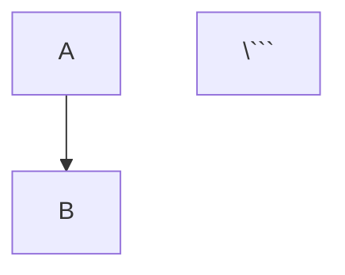

# Session Handoff: Playbooks 12-16 Implementation

**Handoff Date:** November 27, 2025
**Handoff Type:** Implementation Blueprint
**Scope:** 5 New Playbooks (~5,000+ lines total)
**Source Document:** `/storage/emulated/0/Download/gemini-3-pro/suggestions/SUGGESTIONS-PLAYBOOKS.md`
**Methodology:** NLKE v3.0 - Build WITH AI, Document AS you build

---

## Executive Summary

### What This Handoff Covers

This handoff provides a complete implementation blueprint for creating **5 strategic playbooks** (PB 12-16) that fill critical gaps in the current playbook system:

1. **Playbook 16: Prompt Engineering & System Prompts** (Foundation)
2. **Playbook 12: Production Deployment & Operations** (Integration)
3. **Playbook 15: Testing & Quality Assurance for AI Systems** (Integration)
4. **Playbook 14: Embedding Systems & Semantic Search** (Advanced)
5. **Playbook 13: Multi-Model Orchestration Workflows** (Advanced)

### Expected Outcomes

Upon completion, you will have:

- ✅ **5 new playbooks** (~5,000+ lines total, average 1,000 lines each)
- ✅ **All playbooks following PB 0 standards** (header, TOC, sections, examples)
- ✅ **Updated ecosystem files** (PLAYBOOK-INDEX.md, CLAUDE.md, playbook-system.mmd)
- ✅ **Cross-references added** to existing playbooks
- ✅ **Complete reading paths** for new capability areas

### Prerequisites

Before implementing:

1. ✅ **Read existing playbooks** (PB 0-11) to understand style and structure
2. ✅ **Review PLAYBOOK-0-PLAYBOOK-SYSTEM.md** - the template and conventions
3. ✅ **Review SUGGESTIONS-PLAYBOOKS.md** - the strategic rationale
4. ✅ **Have access to:**
   - Existing playbook files
   - PLAYBOOK-INDEX.md
   - CLAUDE.md
   - playbook-system.mmd

### Why These 5 Playbooks Now

From SUGGESTIONS-PLAYBOOKS.md analysis:

| Playbook | Priority | Impact | Effort | Rationale |
|----------|----------|--------|--------|-----------|
| PB 16 (Prompts) | P1 | High | Medium | Foundational skill, no prerequisites |
| PB 12 (Deployment) | P1 | High | High | Production readiness critical |
| PB 15 (Testing) | P2 | High | Medium | Quality assurance essential |
| PB 14 (Embeddings) | P2 | Medium | High | Documents proven 88.5% recall system |
| PB 13 (Multi-Model) | P3 | Medium | Medium | Multi-model is the future |

---

## Implementation Todos (Detailed)

### Priority Order: Dependency-Driven Implementation

**Implementation Sequence:**
```
PB 16 (Prompts) → PB 12 (Deployment) → PB 15 (Testing) → PB 14 (Embeddings) → PB 13 (Multi-Model)
```

**Rationale:**
1. PB 16 first - foundational, no prerequisites
2. PB 12 second - production context for testing
3. PB 15 third - testing framework for embeddings/multi-model
4. PB 14 fourth - embedding knowledge for multi-model routing
5. PB 13 last - depends on understanding of all capabilities

---

### Task 1: Playbook 16 - Prompt Engineering & System Prompts

**File:** `PLAYBOOK-16-PROMPT-ENGINEERING-SYSTEM-PROMPTS.md`
**Category:** Foundation
**Estimated Lines:** ~1,000 lines
**Difficulty:** Intermediate

#### Acceptance Criteria

- [ ] Covers all 10 required sections (see Section Outline below)
- [ ] Includes 15+ code examples (prompts, templates, patterns)
- [ ] Contains 5+ real-world examples with before/after comparisons
- [ ] Cross-references PB 1 (caching), PB 2 (thinking), PB 3 (agents)
- [ ] Includes prompt anti-patterns section
- [ ] Has prompt testing methodology
- [ ] Contains prompt library examples
- [ ] Header block complete with all metadata

#### Section Outline (10+ sections)

1. **Overview**
   - What is prompt engineering?
   - Why it matters (quality, cost, consistency)
   - What you'll learn

2. **Prompt Engineering Fundamentals**
   - Prompt anatomy (instruction, context, examples, output format)
   - Clear vs ambiguous instructions
   - Context relevance
   - Role-based prompting
   - Output format specification

3. **System Prompt Architecture**
   - What are system prompts?
   - System prompt components (role, constraints, capabilities)
   - System prompt patterns (assistant, expert, validator)
   - Multi-persona system prompts
   - System prompt versioning

4. **Few-Shot & Chain-of-Thought**
   - Zero-shot vs few-shot vs many-shot
   - Example selection strategies
   - Chain-of-thought prompting
   - Self-consistency techniques
   - When to use each approach

5. **Prompt Templates & Variables**
   - Template design patterns
   - Variable interpolation
   - Conditional sections
   - Template libraries
   - Reusable prompt components

6. **Output Format Control**
   - JSON output (schema specification)
   - XML output (tag structure)
   - Markdown output (formatting)
   - Structured data extraction
   - Format validation

7. **Prompt Optimization Techniques**
   - Iterative refinement
   - A/B testing prompts
   - Prompt compression
   - Cache-friendly prompt structure (PB 1)
   - Token efficiency

8. **Testing & Iterating Prompts**
   - Test case design
   - Evaluation criteria
   - Regression testing
   - Version comparison
   - Quality metrics

9. **Prompt Libraries & Reuse**
   - Building prompt libraries
   - Categorization strategies
   - Documentation standards
   - Sharing best practices
   - Version control for prompts

10. **Anti-Patterns to Avoid**
    - Overly complex instructions
    - Missing context
    - Ambiguous language
    - Over-constraining
    - Under-specifying output format
    - Conflicting instructions

11. **Real-World Examples**
    - Document Q&A prompt design
    - Code generation prompts
    - Analysis prompts
    - Agent system prompts
    - Validation prompts

12. **Additional Resources**

#### Content Requirements Per Section

**Section 1 (Overview):**
- 3-paragraph explanation of prompt engineering
- Table comparing good vs bad prompts
- Learning objectives (5+ bullet points)

**Section 2 (Fundamentals):**
- Prompt anatomy diagram
- 5+ examples showing before/after
- Instruction clarity checklist

**Section 3 (System Prompts):**
- System prompt template
- 3+ complete system prompt examples
- Component breakdown table

**Section 4 (Few-Shot & CoT):**
- Zero-shot example
- Few-shot example (3 examples)
- Chain-of-thought example
- Decision matrix for approach selection

**Section 5 (Templates):**
- Template syntax examples
- Variable interpolation code
- 3+ reusable templates

**Section 6 (Output Format):**
- JSON schema example
- XML structure example
- Markdown formatting example
- Validation code snippets

**Section 7 (Optimization):**
- Iterative refinement workflow
- A/B test setup
- Cache breakpoint strategy (link to PB 1)
- Token counting examples

**Section 8 (Testing):**
- Test case format
- Evaluation rubric
- Regression test suite example
- Quality metric dashboard

**Section 9 (Libraries):**
- Library structure example
- Categorization taxonomy
- Documentation template
- Git workflow for prompts

**Section 10 (Anti-Patterns):**
- 8+ anti-patterns with examples
- Each with "Why it fails" and "Better approach"

**Section 11 (Examples):**
- 5+ complete real-world examples
- Each with context, prompt, output, lessons learned

#### Code Examples Needed (15+)

1. Basic instruction prompt
2. Role-based system prompt
3. Few-shot classification prompt
4. Chain-of-thought reasoning prompt
5. JSON output schema prompt
6. XML extraction prompt
7. Markdown report prompt
8. Template with variables
9. Cache-optimized prompt (PB 1)
10. Agent system prompt (PB 3)
11. Thinking-enabled prompt (PB 2)
12. Prompt test case
13. A/B test comparison
14. Prompt library entry
15. Anti-pattern fix example

#### Real-World Examples to Include (5+)

1. **Document Q&A System**
   - Before: Generic question-answering
   - After: Structured Q&A with citations
   - Lessons: Context windowing, output format

2. **Code Review Assistant**
   - Before: "Review this code"
   - After: Structured review with severity levels
   - Lessons: Few-shot examples, output structure

3. **Data Extraction Pipeline**
   - Before: Unstructured extraction
   - After: Schema-validated JSON
   - Lessons: Format control, validation

4. **Multi-Turn Agent**
   - Before: Stateless responses
   - After: Context-aware agent with memory
   - Lessons: System prompts, state management

5. **Batch Analysis Workflow**
   - Before: Individual prompts per item
   - After: Cached system context, optimized batch
   - Lessons: Caching (PB 1), batch patterns

#### Estimated Line Count: ~1,000 lines

- Overview: 100 lines
- Fundamentals: 150 lines
- System Prompts: 120 lines
- Few-Shot & CoT: 100 lines
- Templates: 90 lines
- Output Format: 110 lines
- Optimization: 100 lines
- Testing: 80 lines
- Libraries: 70 lines
- Anti-Patterns: 100 lines
- Real-World Examples: 150 lines
- Resources: 30 lines

---

### Task 2: Playbook 12 - Production Deployment & Operations

**File:** `PLAYBOOK-12-PRODUCTION-DEPLOYMENT-OPERATIONS.md`
**Category:** Integration
**Estimated Lines:** ~1,200 lines
**Difficulty:** Advanced

#### Acceptance Criteria

- [ ] Covers all 12 required sections
- [ ] Includes deployment architecture diagrams (Mermaid)
- [ ] Contains infrastructure-as-code examples
- [ ] Cross-references PB 1 (cost), PB 3 (agents), PB 10 (MCP)
- [ ] Includes monitoring dashboards
- [ ] Has incident response playbooks
- [ ] Contains 5+ production case studies
- [ ] Security hardening checklist complete

#### Section Outline (12+ sections)

1. **Overview**
   - Production deployment challenges
   - Operational excellence principles
   - What you'll learn

2. **Deployment Architecture Patterns**
   - Serverless (Lambda, Cloud Functions)
   - Container-based (Docker, Kubernetes)
   - Hybrid architectures
   - Edge deployment
   - Architecture decision matrix

3. **Infrastructure Setup**
   - Serverless setup (AWS Lambda example)
   - Container setup (Docker + K8s)
   - Environment configuration
   - Secret management
   - Network configuration

4. **Monitoring & Observability**
   - Key metrics (latency, error rate, cost)
   - Logging strategy
   - Distributed tracing
   - Metrics dashboards
   - Alerting setup

5. **Error Handling & Recovery**
   - Error classification
   - Retry strategies (exponential backoff)
   - Circuit breakers
   - Graceful degradation
   - Error aggregation

6. **Scaling Strategies**
   - Horizontal vs vertical scaling
   - Auto-scaling configuration
   - Load balancing
   - Rate limiting
   - Capacity planning

7. **Cost Management in Production**
   - Cost monitoring
   - Budget alerts
   - Cost optimization (PB 1)
   - Usage forecasting
   - Cost attribution

8. **Security Hardening**
   - API key rotation
   - Network security
   - Input validation
   - Output sanitization
   - Compliance considerations (GDPR, SOC2)

9. **Incident Response**
   - Incident severity levels
   - Response procedures
   - Communication protocols
   - Post-mortem template
   - Incident log

10. **Rollback Procedures**
    - Blue-green deployment
    - Canary releases
    - Feature flags
    - Rollback triggers
    - Rollback automation

11. **Health Checks & Alerting**
    - Health check endpoints
    - Readiness vs liveness probes
    - Alert rules
    - On-call rotation
    - Escalation policy

12. **Real-World Case Studies**
    - High-volume API deployment
    - Agent system in production
    - MCP server deployment
    - Multi-region setup
    - Cost optimization success story

#### Content Requirements Per Section

**Section 2 (Architecture):**
- Mermaid diagrams for each pattern
- Pros/cons table
- Cost comparison
- Decision matrix

**Section 3 (Infrastructure):**
- Complete IaC examples (Terraform/CloudFormation)
- Docker Compose file
- Kubernetes manifests
- Environment variable templates

**Section 4 (Monitoring):**
- Prometheus/Grafana setup
- CloudWatch dashboard config
- Sample metrics queries
- Alert rule examples

**Section 5 (Error Handling):**
- Error taxonomy
- Retry logic pseudocode
- Circuit breaker implementation
- Dead letter queue setup

**Section 6 (Scaling):**
- Auto-scaling policy examples
- Load balancer config
- Rate limit implementation
- Capacity calculation formulas

**Section 7 (Cost Management):**
- Cost tracking dashboard
- Budget alert setup (AWS/GCP)
- Cost optimization checklist (from PB 1)
- ROI calculation

**Section 8 (Security):**
- Security checklist (20+ items)
- Key rotation script
- Input validation examples
- OWASP Top 10 for AI systems

**Section 9 (Incident Response):**
- Incident severity matrix
- Response runbook template
- Communication template
- Post-mortem structure

**Section 10 (Rollback):**
- Blue-green deployment diagram
- Canary release configuration
- Feature flag implementation
- Automated rollback script

**Section 11 (Health Checks):**
- Health check endpoint code
- Probe configuration (K8s)
- Alert rules (PagerDuty/OpsGenie)
- SLA monitoring

**Section 12 (Case Studies):**
- 5 detailed case studies
- Each with: Problem, Solution, Results, Lessons

#### Code Examples Needed (20+)

1. Serverless function (AWS Lambda)
2. Dockerfile for Claude API service
3. Kubernetes deployment manifest
4. Environment config template
5. Prometheus metrics export
6. Grafana dashboard JSON
7. CloudWatch alarm config
8. Retry logic (Python)
9. Circuit breaker (Python)
10. Auto-scaling policy (AWS)
11. Nginx load balancer config
12. Rate limiter (Redis-backed)
13. API key rotation script
14. Input validation (Python)
15. Health check endpoint (Flask)
16. Blue-green deployment script
17. Feature flag implementation
18. Canary release config
19. Incident response script
20. Cost monitoring query

#### Real-World Examples to Include (5+)

1. **Serverless Claude API Gateway**
   - 100K requests/day
   - 90% cost reduction via caching
   - Auto-scaling to zero

2. **Containerized Agent System**
   - Multi-tenant architecture
   - MCP server integration
   - K8s deployment

3. **Multi-Region Deployment**
   - Global latency optimization
   - Failover strategy
   - Data residency compliance

4. **High-Volume Batch Processing**
   - 1M+ items/day
   - Cost optimization via batch API
   - Error recovery patterns

5. **Production MCP Server**
   - Custom tool deployment
   - Version management
   - Monitoring & alerts

#### Estimated Line Count: ~1,200 lines

---

### Task 3: Playbook 15 - Testing & Quality Assurance for AI Systems

**File:** `PLAYBOOK-15-TESTING-QUALITY-ASSURANCE-AI-SYSTEMS.md`
**Category:** Integration
**Estimated Lines:** ~900 lines
**Difficulty:** Intermediate

#### Acceptance Criteria

- [ ] Covers all 9 required sections
- [ ] Includes testing pyramid for AI
- [ ] Contains 64-test MCP example (from nlke_metacognition_server.py)
- [ ] Cross-references PB 9 (metacognition validation)
- [ ] Includes regression testing strategy
- [ ] Has CI/CD integration examples
- [ ] Contains quality metrics dashboard
- [ ] Test coverage for embeddings, KG, workflows

#### Section Outline (9+ sections)

1. **Overview**
   - Testing AI vs traditional software
   - Quality dimensions for AI
   - What you'll learn

2. **Testing Pyramid for AI Systems**
   - Unit tests (deterministic components)
   - Integration tests (API contracts)
   - System tests (end-to-end workflows)
   - Validation tests (output quality)
   - AI-specific test layers

3. **Unit Testing MCP Tools**
   - Testing individual tools
   - Mock dependencies
   - Assertion strategies
   - Example: 64 tests from metacognition server
   - Coverage measurement

4. **Integration Testing Workflows**
   - Multi-tool workflows
   - Tool chaining tests
   - Error propagation
   - State management tests
   - Example: Agent workflow tests

5. **Embedding Quality Validation**
   - Similarity metric tests
   - Recall/precision measurement
   - Semantic equivalence testing
   - Example: smart_eval.py from gemini-kg
   - Regression detection

6. **KG Integrity Checks**
   - Schema validation
   - Relationship consistency
   - Node uniqueness
   - Orphan detection
   - Example: KG validation suite

7. **Metacognition Validation Testing**
   - 6-layer mud detection tests
   - Texture compatibility tests
   - Synthesis quality tests
   - Recursion depth tracking
   - Example: Phase 1-7 test suite

8. **Regression Testing for AI**
   - Baseline establishment
   - Drift detection
   - Performance regression
   - Quality regression
   - Automated regression suite

9. **Continuous Testing in CI/CD**
   - GitHub Actions example
   - GitLab CI example
   - Test reporting
   - Quality gates
   - Automated rollback on failure

#### Content Requirements Per Section

**Section 2 (Testing Pyramid):**
- AI testing pyramid diagram
- Layer descriptions
- Test distribution ratios
- Coverage targets

**Section 3 (Unit Testing MCP):**
- Complete 64-test example (from metacognition server)
- Test structure template
- Mock patterns
- Assertion examples

**Section 4 (Integration Testing):**
- Workflow test framework
- Multi-tool test scenarios
- Error handling tests
- State management tests

**Section 5 (Embedding Quality):**
- Evaluation framework (from smart_eval.py)
- Test query design
- Recall/precision calculation
- Semantic equivalence checker

**Section 6 (KG Integrity):**
- Schema validation code
- Consistency checks
- SQL test queries
- Automated integrity suite

**Section 7 (Metacognition Validation):**
- Test cases for each phase (1-7)
- Mud detection tests
- Quality threshold tests
- Recursion tests

**Section 8 (Regression Testing):**
- Baseline creation process
- Drift detection algorithm
- Regression test suite
- Alerting on regression

**Section 9 (CI/CD):**
- GitHub Actions workflow
- GitLab CI pipeline
- Test reporting dashboard
- Quality gate configuration

#### Code Examples Needed (15+)

1. MCP tool unit test
2. Mock LLM response
3. Assertion helper functions
4. Workflow integration test
5. Embedding similarity test
6. Recall/precision calculator
7. KG schema validator
8. Relationship consistency check
9. Metacognition mud detection test
10. Texture compatibility test
11. Regression baseline creation
12. Drift detection script
13. GitHub Actions workflow
14. Test report generator
15. Quality gate script

#### Real-World Examples to Include (5+)

1. **MCP Metacognition Server (64 tests)**
   - From nlke_metacognition_server.py --test
   - All 7 phases tested
   - Quality validation examples

2. **Embedding System Testing**
   - From smart_eval.py
   - 88.5% recall validation
   - Regression prevention

3. **KG Integrity Suite**
   - Schema validation
   - Consistency checks
   - Automated daily runs

4. **Agent Workflow Testing**
   - Multi-turn conversation tests
   - Tool chaining validation
   - Error recovery tests

5. **CI/CD Integration**
   - Automated test runs
   - Quality gates
   - Rollback on failure

#### Estimated Line Count: ~900 lines

---

### Task 4: Playbook 14 - Embedding Systems & Semantic Search

**File:** `PLAYBOOK-14-EMBEDDING-SYSTEMS-SEMANTIC-SEARCH.md`
**Category:** Advanced
**Estimated Lines:** ~1,100 lines
**Difficulty:** Expert

#### Acceptance Criteria

- [ ] Covers all 11 required sections
- [ ] Documents 88.5% recall achievement
- [ ] Includes complete architecture (TokenEncoder → Contextualizer → GraphFusion)
- [ ] Contains hybrid search formula (α=0.40, β=0.45, γ=0.15)
- [ ] Cross-references PB 4 (KG), PB 6 (ML), PB 8 (learning)
- [ ] Includes anti-patterns section
- [ ] Has retraining procedures
- [ ] Contains benchmarking methodology

#### Section Outline (11+ sections)

1. **Overview**
   - What are self-supervised embeddings?
   - Why 88.5% recall matters
   - What you'll learn

2. **Self-Supervised Embedding Theory**
   - No external models required
   - KG structure as training curriculum
   - InfoNCE contrastive loss
   - Positive/negative sampling
   - Training convergence

3. **Architecture: TokenEncoder → Contextualizer → GraphFusion**
   - TokenEncoder: token → base embedding (256-dim)
   - Contextualizer: attention-weighted composition
   - GraphFusion: η×text + (1-η)×neighbors
   - Normalization
   - Complete architecture diagram

4. **Training: InfoNCE Contrastive Loss**
   - Loss function derivation
   - Positive sampling (KG edges)
   - Negative sampling (random)
   - Batch construction
   - Hyperparameter tuning
   - Training script walkthrough

5. **Hybrid Search: Embedding + BM25 + Graph Boost**
   - Why hybrid outperforms single methods
   - Embedding similarity (α=0.40)
   - BM25 keywords (β=0.45)
   - Graph neighbor boost (γ=0.15)
   - Score combination
   - Weight optimization process

6. **The Winning Formula (α=0.40, β=0.45, γ=0.15)**
   - How weights were discovered
   - Ablation study results
   - Performance comparison table
   - Why this ratio works
   - When to retune weights

7. **Intent Keywords & Query Expansion**
   - Intent keyword detection
   - 5x weight boost for intent keywords
   - Targeted query expansion (not comprehensive)
   - Expansion strategy examples
   - When expansion helps vs hurts

8. **Evaluation: Strict vs Semantic Recall**
   - Strict recall (exact matches)
   - Semantic recall (equivalent answers)
   - Evaluation framework (smart_eval.py)
   - Benchmark queries (10-query suite)
   - Ground truth curation

9. **Anti-Patterns (What Failed)**
   - RRF with 7 strategies (66.7% recall)
   - Comprehensive synonym expansion
   - Pure embedding search (~50%)
   - Pure BM25 search (~60%)
   - Category filtering
   - The color mixing metaphor

10. **Production Deployment**
    - Embedding storage (pickle, database)
    - Query optimization
    - Index building
    - Caching strategies
    - Scaling considerations

11. **Continuous Improvement**
    - Retraining triggers
    - New content integration
    - Quality monitoring
    - A/B testing new weights
    - Feedback loops

#### Content Requirements Per Section

**Section 2 (Theory):**
- Self-supervised learning explanation
- KG structure importance
- InfoNCE loss formula
- Training convergence graph

**Section 3 (Architecture):**
- Complete architecture diagram (Mermaid)
- Each component explained
- Dimensionality at each stage
- Code walkthrough (contextual_embeddings.py)

**Section 4 (Training):**
- Loss function code
- Sampling strategy code
- Batch construction example
- Hyperparameter grid
- Training script

**Section 5 (Hybrid Search):**
- Hybrid formula derivation
- Each component calculation
- Score combination code
- Weight tuning methodology

**Section 6 (Winning Formula):**
- Ablation study table
- Performance comparison graph
- Weight sensitivity analysis
- Optimization process documentation

**Section 7 (Intent Keywords):**
- Intent detection logic
- Keyword weight boost code
- Expansion rules
- Example expansions

**Section 8 (Evaluation):**
- Evaluation framework code (smart_eval.py)
- Benchmark query suite
- Ground truth structure
- Recall calculation

**Section 9 (Anti-Patterns):**
- RRF implementation (what failed)
- Why it failed (signal vs noise)
- Color mixing metaphor diagram
- Lessons learned table

**Section 10 (Production):**
- Embedding storage code
- Query API code
- Index building script
- Caching strategy

**Section 11 (Improvement):**
- Retraining procedure
- New content workflow
- Quality metrics dashboard
- Feedback integration

#### Code Examples Needed (20+)

1. TokenEncoder class
2. Contextualizer class
3. GraphFusion class
4. InfoNCE loss function
5. Positive sampling code
6. Negative sampling code
7. Batch construction
8. Training loop
9. Embedding similarity calculation
10. BM25 scoring
11. Graph boost calculation
12. Hybrid score combination
13. Intent keyword detector
14. Query expansion logic
15. Recall calculator (strict)
16. Recall calculator (semantic)
17. Embedding storage (pickle)
18. Index builder
19. Query API
20. Retraining script

#### Real-World Examples to Include (5+)

1. **88.5% Recall Achievement**
   - From gemini-kg/best_query.py
   - Query examples
   - Result analysis

2. **Intent Keyword Success**
   - "reduce API costs" query
   - Keyword boost impact
   - Before/after comparison

3. **Semantic Equivalence Discovery**
   - workflow_safe_experimentation vs use_case_experiment_safely
   - Why considered equivalent
   - How semantic eval handles

4. **Anti-Pattern: RRF Failure**
   - 7-strategy combination
   - Why 66.7% < 88.5%
   - Signal dilution analysis

5. **Production Deployment**
   - Real-time query serving
   - Index refresh strategy
   - Performance metrics

#### Estimated Line Count: ~1,100 lines

---

### Task 5: Playbook 13 - Multi-Model Orchestration Workflows

**File:** `PLAYBOOK-13-MULTI-MODEL-ORCHESTRATION-WORKFLOWS.md`
**Category:** Advanced
**Estimated Lines:** ~1,000 lines
**Difficulty:** Advanced

#### Acceptance Criteria

- [ ] Covers all 10 required sections
- [ ] Documents routing decision framework
- [ ] Includes Claude vs Gemini capability mapping
- [ ] Contains cost comparison tables
- [ ] Cross-references ORCHESTRATION.md
- [ ] Includes fallback strategies
- [ ] Has context handoff patterns
- [ ] Contains 5+ multi-model examples

#### Section Outline (10+ sections)

1. **Overview**
   - Why multi-model?
   - Single-model limitations
   - What you'll learn

2. **Model Capability Mapping**
   - Claude strengths (reasoning, code, complex logic)
   - Gemini strengths (context, multimodal, speed)
   - Capability comparison matrix
   - Cost comparison table
   - Latency comparison

3. **Routing Decision Framework**
   - Task classification
   - Routing rules (if-then)
   - ML-based routing (optional)
   - Cost-aware routing
   - Quality-aware routing
   - Decision tree diagram

4. **Implementation Patterns**
   - Pattern 1: Static routing (task type → model)
   - Pattern 2: Dynamic routing (context size → model)
   - Pattern 3: Cascade routing (cheap → expensive)
   - Pattern 4: Parallel routing (cross-validation)
   - Pattern 5: Adaptive routing (feedback-driven)

5. **Cross-Model Validation**
   - Why validate across models?
   - Validation patterns
   - Disagreement resolution
   - Confidence scoring
   - Example: Critical decisions

6. **Context Handoff Between Models**
   - Context serialization
   - Format conversion
   - Context compression
   - Handoff protocol
   - Example: Claude → Gemini handoff

7. **Cost-Optimized Routing**
   - Cost matrix (Claude vs Gemini)
   - Budget-aware routing
   - Batch routing (Gemini Flash)
   - Cache-aware routing (PB 1)
   - ROI calculation

8. **Fallback Strategies**
   - Primary/secondary model setup
   - Timeout handling
   - Error-triggered fallback
   - Rate limit fallback
   - Circuit breaker pattern

9. **Testing Multi-Model Workflows**
   - Test case design
   - Routing validation
   - Handoff testing
   - Fallback testing
   - Integration with PB 15

10. **Production Considerations**
    - Model version management
    - API key rotation
    - Monitoring per model
    - Cost tracking
    - Quality metrics

#### Content Requirements Per Section

**Section 2 (Capability Mapping):**
- Capability matrix (from ORCHESTRATION.md)
- Cost table (per 1M tokens)
- Latency benchmarks
- Use case recommendations

**Section 3 (Routing Framework):**
- Decision tree (Mermaid)
- Routing rules table
- Classification logic
- Cost/quality trade-offs

**Section 4 (Implementation Patterns):**
- 5 patterns with code examples
- Each with: Description, When to use, Code, Example

**Section 5 (Cross-Validation):**
- Validation workflow
- Disagreement resolution logic
- Confidence calculation
- Example: High-stakes decision

**Section 6 (Context Handoff):**
- Handoff protocol diagram
- Serialization code
- Compression techniques
- Example handoff

**Section 7 (Cost-Optimized):**
- Cost comparison table
- Routing optimization algorithm
- Budget allocation code
- ROI calculator

**Section 8 (Fallback):**
- Fallback decision tree
- Timeout configuration
- Error handling code
- Circuit breaker implementation

**Section 9 (Testing):**
- Test suite structure
- Routing test cases
- Handoff tests
- Fallback tests

**Section 10 (Production):**
- Version management strategy
- Key rotation script
- Monitoring dashboard
- Cost tracking

#### Code Examples Needed (15+)

1. Static routing function
2. Dynamic routing (context size)
3. Cascade routing (try cheap first)
4. Parallel routing (both models)
5. Adaptive routing (feedback)
6. Cross-validation logic
7. Disagreement resolution
8. Context serialization
9. Context compression
10. Handoff protocol implementation
11. Cost calculator
12. Budget allocator
13. Fallback handler
14. Circuit breaker
15. Multi-model test suite

#### Real-World Examples to Include (5+)

1. **Large Document Analysis**
   - Use Gemini for 1M token context
   - Hand off to Claude for complex reasoning
   - Cost savings analysis

2. **Batch Processing**
   - Gemini Flash for 95% of items
   - Claude for complex edge cases
   - 90% cost reduction

3. **Multi-Turn Agent**
   - Claude for reasoning
   - Gemini for knowledge retrieval
   - Context handoff per turn

4. **Cross-Validation Pipeline**
   - Both models analyze same input
   - Disagreement triggers human review
   - Quality improvement metrics

5. **Cost-Optimized Workflow**
   - Budget-aware routing
   - Quality threshold enforcement
   - ROI analysis

#### Estimated Line Count: ~1,000 lines

---

## Technical Specifications

### Playbook Naming Convention

```
PLAYBOOK-N-TITLE-WITH-DASHES.md
```

**Examples:**
- `PLAYBOOK-12-PRODUCTION-DEPLOYMENT-OPERATIONS.md`
- `PLAYBOOK-13-MULTI-MODEL-ORCHESTRATION-WORKFLOWS.md`
- `PLAYBOOK-14-EMBEDDING-SYSTEMS-SEMANTIC-SEARCH.md`
- `PLAYBOOK-15-TESTING-QUALITY-ASSURANCE-AI-SYSTEMS.md`
- `PLAYBOOK-16-PROMPT-ENGINEERING-SYSTEM-PROMPTS.md`

### Required Header Format

```markdown
# Playbook N: [Title]
## [Subtitle describing the capability]

**Version:** 1.0
**Last Updated:** [Month Year]
**Target Audience:** [Who should read this]
**Difficulty:** [Beginner/Intermediate/Advanced/Expert]
**Time to Implement:** [Realistic estimate]
**Value:** [What readers will achieve]
**Related Playbooks:** [Links to 3+ related playbooks with brief descriptions]
```

### Required Sections (Per PB 0)

Every playbook MUST have:

1. ✅ **Header Block** (see above)
2. ✅ **Table of Contents** (numbered list with anchor links)
3. ✅ **Overview Section** (not "Introduction")
   - What is [Topic]?
   - Why [Topic] Matters
   - What You'll Learn
4. ✅ **Core Content Sections** (10+ sections typical)
5. ✅ **Additional Resources Section**
   - Must have "See Also (Playbooks):" subsection
   - Links to 3+ related playbooks
   - External resources
6. ✅ **Footer Block**
   ```markdown
   ---

   **Playbook Version:** 1.0
   **Last Updated:** [Date]
   **Created By:** [Author]
   **Methodology:** NLKE v3.0 - Build WITH AI, Document AS you build
   ```

### Section Naming Standards

**ALWAYS use:**
- `## Overview` (not "Introduction")
- `## Table of Contents` (not "TOC")
- `## Additional Resources` (not "See Also" as section)
- `**See Also (Playbooks):**` (subsection in Additional Resources)

### Cross-Reference Format

**In header metadata:**
```markdown
**Related Playbooks:** [PB 3](PLAYBOOK-3-AGENT-DEVELOPMENT.md) (agent costs), [PB 4](PLAYBOOK-4-KNOWLEDGE-ENGINEERING.md) (KG costs)
```

**In See Also section:**
```markdown
- **[Playbook 3: Agent Development](PLAYBOOK-3-AGENT-DEVELOPMENT.md)** - Build autonomous workflows with cost optimization
```

### Code Block Standards

Always specify language:

```markdown
```python
# Python code
\```

```bash
# Shell commands
\```

```json
// JSON data
\```



### Index Updates Needed

#### 1. PLAYBOOK-INDEX.md Updates

Add to **Quick Reference Matrix:**
```markdown
| 12 | [Production Deployment](PLAYBOOK-12-PRODUCTION-DEPLOYMENT-OPERATIONS.md) | Production operations | High | High | PB 3, 10 |
| 13 | [Multi-Model Orchestration](PLAYBOOK-13-MULTI-MODEL-ORCHESTRATION-WORKFLOWS.md) | Hybrid Claude+Gemini | Medium | High | PB 1, 3 |
| 14 | [Embedding Systems](PLAYBOOK-14-EMBEDDING-SYSTEMS-SEMANTIC-SEARCH.md) | Semantic search | High | High | PB 4, 6 |
| 15 | [Testing & QA](PLAYBOOK-15-TESTING-QUALITY-ASSURANCE-AI-SYSTEMS.md) | AI system testing | Medium | High | PB 9, 10 |
| 16 | [Prompt Engineering](PLAYBOOK-16-PROMPT-ENGINEERING-SYSTEM-PROMPTS.md) | Prompt optimization | Low | High | None |
```

Add to **Reading Paths:**
```markdown
### Path 6: Production Excellence
**Goal:** Deploy and operate AI systems at scale

1. **Start:** PB 16 (Prompt Engineering) - Foundation
2. **Then:** PB 12 (Production Deployment) - Operations
3. **Then:** PB 15 (Testing & QA) - Quality assurance
4. **Advanced:** PB 13 (Multi-Model) - Orchestration
```

Add **Comprehensive Summaries** for each playbook (similar to existing)

Update **Feature Comparison Matrix** with new columns

#### 2. CLAUDE.md Updates

Update playbook count:
```markdown
**Total Playbooks:** 17 (was 12)
**Total Lines:** ~18,500 (was ~13,500)
```

Update playbook table:
```markdown
| # | Playbook | Primary Use Case |
|---|----------|------------------|
| ... existing ... |
| 12 | [Production Deployment](playbooks/PLAYBOOK-12-PRODUCTION-DEPLOYMENT-OPERATIONS.md) | Production operations |
| 13 | [Multi-Model Orchestration](playbooks/PLAYBOOK-13-MULTI-MODEL-ORCHESTRATION-WORKFLOWS.md) | Hybrid workflows |
| 14 | [Embedding Systems](playbooks/PLAYBOOK-14-EMBEDDING-SYSTEMS-SEMANTIC-SEARCH.md) | Semantic search |
| 15 | [Testing & QA](playbooks/PLAYBOOK-15-TESTING-QUALITY-ASSURANCE-AI-SYSTEMS.md) | AI testing |
| 16 | [Prompt Engineering](playbooks/PLAYBOOK-16-PROMPT-ENGINEERING-SYSTEM-PROMPTS.md) | Prompt optimization |
```

#### 3. playbook-system.mmd Updates

Add nodes and edges:
```mermaid
PB16[PB 16: Prompt Engineering] --> PB1
PB16 --> PB2
PB16 --> PB3

PB12[PB 12: Production Deployment] --> PB1
PB12 --> PB3
PB12 --> PB10

PB15[PB 15: Testing & QA] --> PB9
PB15 --> PB10

PB14[PB 14: Embedding Systems] --> PB4
PB14 --> PB6

PB13[PB 13: Multi-Model] --> PB1
PB13 --> PB3
PB13 --> PB7
```

#### 4. PLAYBOOK-0-PLAYBOOK-SYSTEM.md Updates

Update catalog table:
```markdown
| 12 | Production Deployment | Integration | Production operations |
| 13 | Multi-Model Orchestration | Advanced | Hybrid workflows |
| 14 | Embedding Systems | Advanced | Semantic search |
| 15 | Testing & QA | Integration | AI system testing |
| 16 | Prompt Engineering | Foundation | Prompt optimization |
```

Update dependency graph with new connections

---

## Reference Materials

### Primary Reference: SUGGESTIONS-PLAYBOOKS.md

**Location:** `/storage/emulated/0/Download/gemini-3-pro/suggestions/SUGGESTIONS-PLAYBOOKS.md`

**Contains:**
- Strategic rationale for each playbook
- Target audience analysis
- Synergy with existing playbooks
- Dependency graph
- Implementation priority

### Template Reference: PLAYBOOK-0-PLAYBOOK-SYSTEM.md

**Location:** `/storage/emulated/0/Download/gemini-3-pro/playbooks/PLAYBOOK-0-PLAYBOOK-SYSTEM.md`

**Use for:**
- Header format
- Section structure
- Naming conventions
- Quality checklist
- Footer format

### Index Reference: PLAYBOOK-INDEX.md

**Location:** `/storage/emulated/0/Download/gemini-3-pro/playbooks/PLAYBOOK-INDEX.md`

**Use for:**
- Quick reference matrix structure
- Reading path structure
- Comprehensive summary format
- Feature comparison matrix

### Style References: Existing Playbooks

**Read for style consistency:**
- `PLAYBOOK-1-COST-OPTIMIZATION.md` - Foundation style, code examples
- `PLAYBOOK-3-AGENT-DEVELOPMENT.md` - Integration style, multi-concept
- `PLAYBOOK-6-AUGMENTED-INTELLIGENCE-ML.md` - Advanced style, theoretical depth
- `PLAYBOOK-9-METACOGNITION-WORKFLOWS.md` - Complex system documentation
- `PLAYBOOK-10-MCP-SERVER-DEVELOPMENT.md` - Technical implementation detail

### Conceptual Reference: ORCHESTRATION.md

**Location:** `/storage/emulated/0/Download/gemini-3-pro/ORCHESTRATION.md`

**Use for:**
- PB 13 (Multi-Model): Model routing concepts
- Capability comparison tables
- Cost comparison data

### Implementation Reference: gemini-kg/

**Location:** `/storage/emulated/0/Download/gemini-3-pro/gemini-kg/`

**Use for:**
- PB 14 (Embeddings):
  - `contextual_embeddings.py` - Architecture
  - `best_query.py` - Hybrid search
  - `smart_eval.py` - Evaluation
  - `SYNTHESIZED_INSIGHTS.md` - Anti-patterns

### Testing Reference: nlke_mcp/

**Location:** `/storage/emulated/0/Download/gemini-3-pro/nlke_mcp/`

**Use for:**
- PB 15 (Testing):
  - `servers/nlke_metacognition_server.py --test` - 64 tests
  - Test structure patterns
  - MCP testing approach

---

## Validation Checklist

### Per-Playbook Validation

Use this checklist for EACH playbook before considering it complete:

#### Header Block
- [ ] Has Version number (start with 1.0)
- [ ] Has Last Updated date (Month Year format)
- [ ] Has Target Audience
- [ ] Has Difficulty level (Beginner/Intermediate/Advanced/Expert)
- [ ] Has Time to Implement (realistic estimate)
- [ ] Has Value statement (what readers achieve)
- [ ] Has 3+ Related Playbooks links with descriptions

#### Structure
- [ ] Has Table of Contents with numbered list
- [ ] All TOC links work (anchor format: #section-name)
- [ ] Uses "Overview" not "Introduction"
- [ ] Has Additional Resources section
- [ ] Has "See Also (Playbooks):" subsection with 3+ links
- [ ] Has footer metadata block

#### Content Quality
- [ ] Has 10+ main sections (per suggestion outline)
- [ ] Has 5+ real-world examples
- [ ] Has 15+ code examples
- [ ] Code blocks specify language
- [ ] Has troubleshooting section
- [ ] Has decision frameworks/matrices
- [ ] No broken links

#### Cross-References
- [ ] Links to 3+ related playbooks in header
- [ ] Links to 3+ related playbooks in See Also
- [ ] References relevant system files (ORCHESTRATION.md, etc.)
- [ ] Cites specific implementations (gemini-kg/, nlke_mcp/)

#### Line Count
- [ ] Meets estimated line count (±10%)
- [ ] Balanced section lengths
- [ ] Sufficient detail without verbosity

### Ecosystem Integration Validation

After creating all 5 playbooks:

#### Index Updates
- [ ] PLAYBOOK-INDEX.md Quick Reference Matrix updated
- [ ] PLAYBOOK-INDEX.md Reading Paths updated (added Path 6)
- [ ] PLAYBOOK-INDEX.md Comprehensive Summaries added (5 new)
- [ ] PLAYBOOK-INDEX.md Feature Comparison Matrix updated
- [ ] PLAYBOOK-INDEX.md Change Log updated

#### System Documentation Updates
- [ ] CLAUDE.md playbook count updated (17 total)
- [ ] CLAUDE.md playbook table updated
- [ ] CLAUDE.md line count updated (~18,500)
- [ ] PLAYBOOK-0-PLAYBOOK-SYSTEM.md catalog updated
- [ ] PLAYBOOK-0-PLAYBOOK-SYSTEM.md dependency graph updated

#### Diagram Updates
- [ ] playbook-system.mmd nodes added (5 new)
- [ ] playbook-system.mmd edges added (connection to existing)
- [ ] Diagram renders correctly

#### Cross-Reference Validation
- [ ] Existing playbooks link to new ones where relevant
- [ ] All new playbook cross-references are bidirectional
- [ ] No orphaned playbooks (all connected to system)

---

## Context for Future Session

### Key Decisions Already Made

1. **Implementation Order:** PB 16 → PB 12 → PB 15 → PB 14 → PB 13
   - Rationale: Dependency-driven (prompts foundation, deployment context for testing, etc.)

2. **Category Assignments:**
   - PB 16: Foundation (no prerequisites)
   - PB 12, 15: Integration (connect multiple systems)
   - PB 14, 13: Advanced (require deep knowledge)

3. **Line Count Targets:**
   - PB 16: ~1,000 lines
   - PB 12: ~1,200 lines
   - PB 15: ~900 lines
   - PB 14: ~1,100 lines
   - PB 13: ~1,000 lines
   - **Total: ~5,200 lines**

4. **Quality Standards:**
   - Follow PB 0 conventions exactly
   - 15+ code examples per playbook minimum
   - 5+ real-world examples per playbook minimum
   - 3+ cross-references per playbook minimum

5. **Reference Strategy:**
   - PB 14 heavily references gemini-kg/ implementation
   - PB 15 heavily references nlke_mcp/ testing
   - PB 13 heavily references ORCHESTRATION.md
   - PB 12 draws from PB 3, 10 production patterns
   - PB 16 is foundational, minimal dependencies

### Dependency Order: Why This Sequence

```
PB 16 (Prompts)
    │
    ├─► Establishes foundational prompt engineering skills
    │   Used in: PB 12 (deployment prompts), PB 15 (test prompts)
    │
    ▼
PB 12 (Deployment)
    │
    ├─► Provides production context needed for:
    │   PB 15 (what to test in production)
    │   PB 13 (how to deploy multi-model)
    │
    ▼
PB 15 (Testing)
    │
    ├─► Establishes testing framework used in:
    │   PB 14 (embedding quality tests)
    │   PB 13 (multi-model workflow tests)
    │
    ▼
PB 14 (Embeddings)
    │
    ├─► Documents embedding systems needed for:
    │   PB 13 (intelligent routing via semantic similarity)
    │
    ▼
PB 13 (Multi-Model)
    │
    └─► Synthesizes knowledge from all previous playbooks
```

### Open Questions to Resolve

1. **PB 12 (Deployment):** Which cloud platforms to prioritize?
   - **Recommendation:** AWS (most common) + GCP (Gemini native) examples
   - Include Docker/K8s for cloud-agnostic patterns

2. **PB 15 (Testing):** How detailed on CI/CD integration?
   - **Recommendation:** GitHub Actions (primary) + GitLab CI (secondary)
   - Focus on AI-specific testing, not general CI/CD

3. **PB 14 (Embeddings):** How much mathematical detail?
   - **Recommendation:** Balance theory with practice
   - Include math but prioritize implementation
   - Reference EMBEDDING-ROADMAP.md for deep theory

4. **PB 13 (Multi-Model):** Include Gemini Code Execution?
   - **Recommendation:** Mention as capability difference
   - Don't deep-dive (not core to routing)

5. **PB 16 (Prompts):** How to structure prompt library?
   - **Recommendation:** By use case (analysis, generation, validation, etc.)
   - Include versioning strategy
   - Reference version control best practices

### Potential Blockers

1. **Code Example Quality:**
   - **Risk:** Generic or incomplete code examples
   - **Mitigation:** Use real code from gemini-kg/, nlke_mcp/, examples/
   - **Fallback:** Create minimal working examples, test before including

2. **Real-World Example Authenticity:**
   - **Risk:** Hypothetical examples that feel inauthentic
   - **Mitigation:** Base on actual project implementations
   - **Fallback:** Clearly label "illustrative example" if not from production

3. **Cross-Reference Consistency:**
   - **Risk:** Broken links or missing references
   - **Mitigation:** Validate all links after writing
   - **Fallback:** Use relative paths, verify file existence

4. **Line Count Deviation:**
   - **Risk:** Playbooks significantly over/under estimated length
   - **Mitigation:** Monitor length during writing, adjust sections
   - **Fallback:** Split into multiple playbooks if >1,500 lines

5. **Time Constraint:**
   - **Risk:** Creating 5 playbooks (~5,000 lines) is substantial work
   - **Mitigation:** Focus on one playbook at a time, validate before next
   - **Fallback:** Prioritize P1 playbooks (16, 12), defer P2/P3 if needed

### Success Criteria

**You will know this handoff is successful when:**

1. ✅ All 5 playbooks created and passing validation checklist
2. ✅ PLAYBOOK-INDEX.md, CLAUDE.md, PB 0 updated correctly
3. ✅ All cross-references bidirectional and working
4. ✅ New reading paths coherent and valuable
5. ✅ Total line count ~5,000-5,500 lines
6. ✅ Code examples tested (or marked as illustrative)
7. ✅ Real-world examples authentic and detailed
8. ✅ Quality matches existing playbook standards

### Handoff to Next Session

If you need to hand off mid-implementation:

**State to Capture:**
- Which playbooks completed (with validation checklist status)
- Which playbooks in progress (section-by-section status)
- Which index files updated
- Any deviations from this handoff (why and what)
- Any new insights about structure/approach

**Use PB 11 (Session Handoff Protocol) to structure the handoff.**

---

## Quick Start Guide for Implementation

### Phase 1: Preparation (30 minutes)

1. **Read reference materials:**
   - [ ] PLAYBOOK-0-PLAYBOOK-SYSTEM.md (full read)
   - [ ] SUGGESTIONS-PLAYBOOKS.md (full read)
   - [ ] PLAYBOOK-INDEX.md (skim structure)
   - [ ] 2-3 existing playbooks (for style)

2. **Verify file access:**
   - [ ] Can read `/storage/emulated/0/Download/gemini-3-pro/playbooks/`
   - [ ] Can write new playbook files
   - [ ] Can edit index files

3. **Create tracking checklist:**
   - [ ] Copy validation checklist for each playbook
   - [ ] Set up progress tracking (use TodoWrite if helpful)

### Phase 2: Implementation (PB 16 first)

1. **Create file:** `PLAYBOOK-16-PROMPT-ENGINEERING-SYSTEM-PROMPTS.md`

2. **Write header block:**
   - Copy template from PB 0
   - Fill in metadata
   - Add 3+ related playbooks

3. **Create Table of Contents:**
   - 10 sections from outline
   - Add anchor links

4. **Write sections sequentially:**
   - Overview (100 lines)
   - Fundamentals (150 lines)
   - ... (see Task 1 outline)

5. **Add code examples:**
   - 15+ examples with language tags
   - Test or mark as illustrative

6. **Add real-world examples:**
   - 5+ detailed examples
   - Include before/after, lessons learned

7. **Write footer block:**
   - Version, date, author, methodology

8. **Validate:**
   - Run through per-playbook checklist
   - Fix any issues

### Phase 3: Repeat for PB 12, 15, 14, 13

Follow same process for each playbook in order.

### Phase 4: Ecosystem Integration

1. **Update PLAYBOOK-INDEX.md:**
   - Quick Reference Matrix (5 rows)
   - Reading Paths (add Path 6)
   - Comprehensive Summaries (5 new)
   - Feature Comparison Matrix (5 columns)
   - Change Log (update date)

2. **Update CLAUDE.md:**
   - Playbook count (17)
   - Line count (~18,500)
   - Playbook table (5 rows)

3. **Update PLAYBOOK-0-PLAYBOOK-SYSTEM.md:**
   - Catalog table (5 rows)
   - Dependency graph (add connections)

4. **Update playbook-system.mmd:**
   - Add 5 nodes
   - Add edges to existing playbooks

### Phase 5: Final Validation

1. **Run ecosystem validation checklist**
2. **Test all links** (sample check)
3. **Verify cross-references** are bidirectional
4. **Check total line count** (~5,000-5,500)
5. **Review quality** against existing playbooks

---

## Appendix: Line Count Estimation Formula

**Section line count estimation:**

```
Base content (prose):          [words / 10] lines
Code examples:                 [examples × 15] lines
Tables/matrices:               [rows + 3] lines
Real-world examples:           [examples × 30] lines
Headers/spacing:               [sections × 5] lines
```

**Example for PB 16 Section 2 (Fundamentals):**

```
Prose (500 words):             50 lines
Code examples (5):             75 lines
Tables (2 with 10 rows each):  26 lines
Spacing/headers:               10 lines
-------------------------------------------
Total:                         161 lines ✓ (target: 150)
```

Use this formula to validate section estimates as you write.

---

## Appendix: Code Example Template

**Use this structure for all code examples:**

```markdown
**Example: [Name of Example]**

**Purpose:** [What this example demonstrates]

**Language:** [Python/Bash/JSON/etc.]

```[language]
# Code with comments explaining key parts
def example_function():
    """Docstring explaining purpose."""
    # Implementation
    pass
\```

**Key Points:**
- Point 1 about the example
- Point 2 about the example

**When to use:**
- Scenario 1
- Scenario 2
```

---

## Appendix: Real-World Example Template

**Use this structure for all real-world examples:**

```markdown
### Example N: [Name]

**Context:**
[Brief description of the scenario, system, or problem]

**Challenge:**
[What was the specific challenge or limitation?]

**Solution:**
[What approach/pattern/technique was used?]

**Implementation:**
```[language]
# Code or configuration showing the solution
\```

**Results:**
- Metric 1: [Before → After]
- Metric 2: [Before → After]
- Metric 3: [Before → After]

**Lessons Learned:**
1. Lesson 1
2. Lesson 2
3. Lesson 3

**Related Patterns:**
- [Link to Playbook/Section]
- [Link to Playbook/Section]
```

---

**End of Handoff Document**

**This handoff is complete and actionable. A future Claude session can pick this up and execute without additional context.**

---

**Handoff Version:** 1.0
**Created By:** Claude Sonnet 4.5 (Session: 2025-11-27)
**Methodology:** NLKE v3.0 - Document for ACTION, not just information
**Validation Status:** Ready for implementation

---

*Use this document as the complete blueprint. Refer to PLAYBOOK-0-PLAYBOOK-SYSTEM.md for conventions, but all strategic decisions and implementation details are captured here.*
