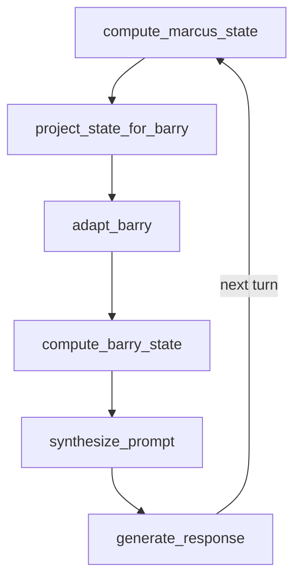

# NLKE Ecosystem - Master Architecture Document

**Author:** Eyal Nof
**Date:** February 8, 2026
**Version:** 1.0
**Scope:** Complete cross-project architecture map covering NLKE, Soccer-AI, Ariel, Flags, and Robert

---

## Table of Contents

- [Part A: Standalone Project Reports](#part-a-standalone-project-reports)
- [Part B: Connection Map](#part-b-connection-map)
- [Part C: Unified Retrieval Layer](#part-c-unified-retrieval-layer)
- [Part D: 4D Agent State Architecture](#part-d-4d-agent-state-architecture)
- [Part E: 3rd Knowledge Formalization](#part-e-3rd-knowledge-formalization)
- [Part F: NOF-Ariel Integration](#part-f-nof-ariel-integration)
- [Part G: Industry Quality Checklist](#part-g-industry-quality-checklist)
- [Part H: API Assistant Architecture](#part-h-api-assistant-architecture)

---

## Part A: Standalone Project Reports

### A.1 NLKE (Natural Language Knowledge Engineering)

**Location:** `/storage/self/primary/Download/44nlke/NLKE/`
**Built:** February 6-7, 2026 (20-hour marathon)
**Status:** Production-ready agent ecosystem

#### What It Is
A 40-agent AI ecosystem for knowledge engineering, cost optimization, code generation, workflow automation, and cross-provider orchestration (Claude + Gemini). Every agent exists in dual format: `.md` for Claude Code context injection and `.py` for standalone CLI execution.

#### Architecture
Every Python agent follows a strict 5-layer pattern:

```
L1: Data Models     — AgentInput/AgentOutput dataclasses (JSON I/O)
L2: Constants       — Paths, pricing, thresholds, model configs
L3: BaseAnalyzer    — Abstract analysis class (inherits agent_base.py)
L4: Orchestrator    — Pipeline composition, multi-stage merging
L5: CLI             — run_standard_cli with --example, --workload, --output, --summary
```

**Output Contract (enforced by SubagentStop hook):**
```python
{
    "recommendations": [...],   # Required: actionable items
    "rules_applied": [...],     # Required: which synthesis rules used
    "meta_insight": "...",      # Required: single emergent observation
    "anti_patterns": [...],     # Optional
    "agent_metadata": {...},    # Optional
    "analysis_data": {...}      # Optional
}
```

#### Agent Distribution by Model Tier

| Tier | Count | Agents |
|------|-------|--------|
| Opus | 4 | opus-expender, compound-intelligence, multi-model-orchestrator, codegen-orchestrator |
| Sonnet | 20 | code-analyzer, relationship-suggester, kg-completer, workflow-orchestrator, generator-agent, cost-quality-frontier, gemini-delegator, rule-engine, rag-kg-query, intent-engine, refactoring-agent, mcp-tool-creator, embedding-engine, gemini-compute, web-research, agentic-tool-router, codegen-python, codegen-javascript, codegen-html-css, codegen-gemini |
| Haiku | 16 | doc-updater, md-cat, py-cat, cost-advisor, batch-optimizer, thinking-budget, kg-health, progressive-assembly, self-healing-docs, context-engineer, anti-pattern-validator, playbook-advisor, citation-analyzer, visual-report, codegen-sql, codegen-bash |

#### Key Components

| Component | File | Lines | Purpose |
|-----------|------|-------|---------|
| Agent Base | agents/shared/agent_base.py | 403 | Shared base class, L1-L5 infrastructure, pricing constants |
| Agent SDK | agents/shared/agent_sdk.py | 307 | 35-agent registry, Pipeline class, dependency tracking |
| FastAPI Site | Eyal-s--agents/site/server.py | 1,265 | 15 routes (10 HTML + 5 JSON), KG visualizer, pipeline builder |
| NOF Spec | Eyal-s--agents/docs/NOF-FORMAT-SPEC.md | 949 | Formal format spec with EBNF grammar |
| Sonnet Agent | sonnet-agent.py | 1,159 | Standalone persistent multi-turn agent |

#### How It Works (Data Flow)
```
User query → Agent SDK identifies agent
           → Pipeline composes stages (with transforms + dependencies)
           → Each stage: L5(CLI) → L4(Orchestrator) → L3(Analyzer.analyze()) → L1(Output)
           → Pipeline merges outputs, deduplicates rules
           → Returns PipelineResult with aggregated recommendations
```

---

### A.2 Soccer-AI

**Location:** `/storage/emulated/0/Download/synthesis-rules/soccer-AI`
**Consolidated copy:** `NLKE/ecosystem/soccer-ai/`
**Status:** Production-ready, strongest portfolio project

#### What It Is
An emotionally intelligent football companion that supports your club with authentic fan emotion, speaks proper football language, knows rivalries, predicts matches (62.9% accuracy), and remembers legends.

#### Architecture
```
React Frontend (TypeScript + Vite)
         |
    HTTP (port 8000)
         |
FastAPI Backend (54KB main.py, 25+ endpoints)
    |         |         |
 4D PERSONA   KG       PREDICTOR
 persona_bridge  unified_kg.db  Power Ratings
 Dimensions XYZT  745 nodes     ELO-style
                   674 edges    Draw Detection
```

#### Key Numbers

| Metric | Value |
|--------|-------|
| Tests | 102/102 passing (35 behavioral + 33 integration + 34 KG migration) |
| Fan personas | 18 (one per Premier League club) |
| KG nodes | 745 (teams, legends, stadiums) |
| KG edges | 674 (43 rivalries, 18 legends) |
| Match history | 230,557 records |
| RAG code | ~3,750 lines (rag.py + kg_integration.py + database.py) |
| Prediction accuracy | 62.9% |
| Feature flag | USE_4D_PERSONA = True |

#### How It Works (Response Pipeline)
```
User message + club_id
  → Input sanitization (null bytes, control chars, length)
  → Injection detection (14 regex patterns, session-based escalation)
  → Entity extraction + alias resolution (~50 aliases)
  → Intent detection (10+ intents: score, injury, transfer, fixture, standing, stats...)
  → KG intent detection (multi_hop, relationship, discovery, emotional, rivalry)
  → Hybrid retrieval: FTS5(beta=0.60) + KG(gamma=0.40)
  → Source deduplication (composite keys)
  → 4D Persona computation:
      X: Emotional (mood from live match results)
      Y: Relational (rivalry detection from KG edges)
      Z: Linguistic (regional dialect: Scouse, Geordie, Cockney, Mancunian)
      T: Temporal (trajectory, velocity, momentum)
  → System prompt synthesis (base + mood + rivalry + dialect injections)
  → Claude Haiku API call (direct HTTP, not SDK)
  → Vocabulary enforcement (game→match, zero→nil, field→pitch)
  → Output validation (leak detection)
  → Response with sources, confidence, usage
```

---

### A.3 Ariel (4D Persona Architecture)

**Location:** `/storage/emulated/0/Download/synthesis-rules/Ariel`
**Consolidated copy:** `NLKE/ecosystem/ariel/`
**Status:** Research framework, architecturally most sophisticated

#### What It Is
A framework that treats AI personas not as descriptions but as computed positions in 4D space: P(t) = (x, y, z, t). Personas derive their behavior from real data, not static prompt declarations.

#### Core Innovation
**Traditional:** "Be enthusiastic" (declared, easily gaslighted)
**4D Persona:** Enthusiasm derived from winning streak (computed, grounded, provable)

#### Architecture
```
PersonaEngine (orchestrator)
    |
    +-- EmotionalComputer (X-axis)
    |     Mood from data signals → mood mapping → EmotionalState
    |     Implementations: Football, Tutor, Student, Architect
    |
    +-- RelationalComputer (Y-axis)
    |     Entity mention detection → KG traversal → RelationalState
    |     In-memory KnowledgeGraph with typed edges
    |
    +-- LinguisticComputer (Z-axis)
    |     Entity → dialect mapping → DialectConfig → LinguisticState
    |     Vocabulary mappings + voice instruction injection
    |
    +-- TemporalComputer (T-axis)
          Step counter → salient event extraction → velocity/momentum
          History windowing (keep 20, return 5)
```

#### Key Numbers

| Metric | Value |
|--------|-------|
| Tests | 105/105 (100% pass rate) |
| Framework code | ~1,739 lines (engine + 4 dimensions) |
| Metacognitive layer | ~550 lines (introspection + monitor + meta_monitor) |
| Reference personas | 4 (Robert, Barry, Marcus, Eyal) |
| Total codebase | 3,700+ lines |

#### Key Concepts

**Velocity:** Rate of change in emotional state between consecutive turns
**Momentum:** Average of recent velocities with direction classification (improving/declining/stable)
**Stability:** Variance-based metric (low variance = high stability, range 0.0-1.0)
**Authenticity:** How grounded in real data (has grounded_in sources = 1.0, else 0.5)

**Metacognitive Stack:**
```
CognitiveProcess (core computation)
    → Monitor (S1: captures before/after state transitions)
        → MetaMonitor (S2: observes Monitor, MAX_DEPTH=2)
            → IntrospectionEngine (orchestrates the stack)
```

---

### A.4 Flags (Knowledge Graph Toolkit)

**Location:** `/storage/emulated/0/Download/synthesis-rules/flags`
**Consolidated copy:** `NLKE/ecosystem/flags/`
**Status:** Working toolkit, was significantly UNDERESTIMATED

#### What It Is
A 9,740-line Python toolkit for building, querying, validating, and reasoning over knowledge graphs built from Claude documentation.

#### File Inventory

| File | Lines | Purpose |
|------|-------|---------|
| query-cookbook.py | 3,507 | Intent-driven KG reasoning engine |
| kg-validate-rules.py | 994 | Architecture validation with RuleRegistry |
| query-cookbook-enhanced.py | 890 | Enhanced query engine |
| kg-ask.py | 770 | Natural language KG interface with embeddings |
| kg-critical-components.py | 689 | Centrality metrics, hub/bridge/leaf analysis |
| kg-impact-analyzer.py | 658 | Change impact analysis, deletion simulation |
| kg-merger.py | 642 | Dual KG merge with namespace isolation |
| kg-pattern-mapper.py | 625 | Pattern-to-code mapping via embeddings |
| kg-query-unified.py | 601 | Dual-KG query with cross-referencing |
| kg-importer.py | 364 | SQLite schema + JSON import |

#### How query-cookbook.py Works (The Reasoning Engine)

This is not simple routing. It's a full KG reasoning engine with 12 query methods:

| Method | Purpose | Pattern |
|--------|---------|---------|
| `want_to(goal)` | "I want to build X" → find capabilities, steps, examples | Intent → nodes → edges → composition |
| `can_it(capability)` | "Can Claude do X?" → yes/no with evidence | Search → metadata extraction → examples |
| `how_does(thing)` | "How does X work?" → dependency/flow analysis | Node → edge types (dependency/flow/component/enables) |
| `compose_for(use_case)` | "I need X" → composition spec (sequential vs parallel) | Use case → capabilities → pipeline detection |
| `discover_emergent_capabilities()` | Find capabilities requiring multiple others | Co-occurrence matrix → multi-capability use cases |
| `optimize_for(criteria)` | "Optimize for cost/speed/quality" → strategies | Keyword scoring across nodes → ranked results |
| `alternatives(to)` | "What else can do X?" → similar capabilities | Same-type nodes with shared edges |
| `compare_nodes(a, b)` | Side-by-side comparison | Dual node lookup → shared/unique edges |
| `trace_relationship(a, b)` | Path between two nodes | Graph traversal → relationship chain |
| `get_provenance(node)` | Where did this knowledge come from? | Metadata: phase, source, discovery_method |
| `get_orchestration_meta(node)` | Orchestration details | trade_offs, best_for, complementary tools |
| `get_arsenal_status()` | Full KG stats | Node types, edge types, connectivity, hubs |

#### How kg-ask.py Works (Natural Language Interface)

```
User natural language query
    → QueryUnderstanding:
        Regex patterns for 6 query types (confidence 0.9)
        Keyword fallback (confidence 0.5)
        Default: semantic_search (confidence 0.3)
    → KGQueryExecutor:
        Load pattern embeddings (50D, NPZ format)
        Load code embeddings (50D, JSON + dim dict)
        Namespace with KG source prefixes
        Execute typed query (pattern_impl, code_understanding, dependencies, semantic, cross_ref, capability)
        Cosine similarity filtering (threshold 0.7, top-K=20)
    → ResultFormatter:
        Output as text, JSON, or markdown
```

---

### A.5 Robert (Soccer-AI v2.0 Blueprint)

**Location:** `/storage/emulated/0/Download/synthesis-rules/robert`
**Consolidated copy:** `NLKE/ecosystem/robert/`
**Status:** ~15% done, architectural blueprint

#### What It Is
An attempt to separate Ariel's 4D framework from Soccer-AI's implementation into a clean architecture. The right idea, but mostly incomplete.

#### What Exists
- Backend: byte-for-byte copy of Soccer-AI
- Framework: Ariel persona_engine.py + 4 dimension computers (dataclass shells, not fully connected)
- 4 test personas (not 18)
- Static Wikipedia extracts for 11 teams
- Comprehensive README and CLAUDE.md documenting the vision

#### What's Missing
- Framework NOT connected to soccer-implementation
- Dimension computers are abstract shells, not wired to live data
- Only 4 personas vs Soccer-AI's 18
- No test suite running against the framework layer

---

## Part B: Connection Map

### The 6 Cross-Project Connections

```
                    NLKE (40 agents)
                   /    |    |    \
                  /     |    |     \
                 /      |    |      \
    [1] Flags ←→ rag-kg-query  [5] Soccer-AI ←→ context-engineer
    [3] Flags → compound-intelligence ("3rd knowledge")
    [6] Flags → anti-pattern-validator (shared RuleRegistry)
                        |
                   [2] Ariel ←→ agent_sdk (4D state)
                        |
                   [4] NOF ←→ Ariel (persona workflows)
```

### Connection 1: Flags query-cookbook → NLKE rag-kg-query

**Gap:** NLKE's rag_kg_query.py is 296 lines with naive keyword matching. Flags' query-cookbook.py is 3,507 lines with intent routing, semantic search, composition, and emergent discovery.

**Solution:** Extract ClaudeCookbookKG as a generic `IntentKG` class. NLKE's rag-kg-query instantiates IntentKG with its own SQLite KGs.

**Impact:** rag-kg-query goes from "find matching words" to "understand what user wants and compose an answer from graph relationships."

### Connection 2: Ariel 4D → NLKE agent dynamic state

**Gap:** NLKE agents have a static model tier (Opus/Sonnet/Haiku). They don't have computed state that changes based on workload or context.

**Solution:** Extract PersonaEngine + DimensionComputer into `agents/shared/persona_4d.py`. Create NLKE-specific computers:
- CostEmotionalComputer: agent "mood" from budget utilization
- KGRelationalComputer: agent relationships from KG edges
- WorkflowTemporalComputer: velocity of task completion

**Impact:** Agents become adaptive. A cost-advisor agent under budget pressure behaves differently than one with surplus.

### Connection 3: discover_emergent_capabilities() = "3rd Knowledge"

**Gap:** The concept of "3rd knowledge" (knowledge that emerges from combining two separate knowledge sources) exists as language but isn't formalized in code — except it IS, in flags/query-cookbook.py.

**Solution:** Extract `discover_emergent_capabilities()` into `agents/shared/emergence.py`. Wire into compound-intelligence agent as primary analysis.

**Implementation detail:**
1. Build co-occurrence matrix of capability pairs
2. For each use case, find which capabilities are required together
3. Identify cases where capability A alone and capability B alone don't solve the use case, but A+B does
4. These are emergent (3rd knowledge) capabilities

**Impact:** compound-intelligence can formally discover and report emergent capabilities from any KG.

### Connection 4: NOF format → Ariel two-persona interaction

**Gap:** Ariel's two_persona_interaction.py (Barry tutoring Marcus) is a workflow with state passing, but it's coded as a Python script, not expressed in NLKE's workflow format.

**Solution:** Create a .nof.md template for persona interactions. The NOF format's state schema (TypedDict accumulator) maps directly to 4D state passing:

```yaml
# Example: persona-interaction.nof.md
state_schema:
  persona_a_state: Persona4D
  persona_b_state: Persona4D
  turn_count: int
  adaptation_rules: Dict

flow:
  - compute_a_state → adapt_b_to_a → compute_b_state → adapt_a_to_b → loop
```

**Impact:** Persona interactions become declarative workflows, composable and reusable.

### Connection 5: Soccer-AI 11 context types → NLKE context-engineer

**Gap:** Soccer-AI's rag.py implements 11 specific context types (team, player, fixture, injury, transfer, news, standing, stats, score, general, KG). NLKE's context-engineer agent (#20) optimizes context but doesn't have a shared taxonomy.

**Solution:** Extract context types into `agents/shared/context_types.py` as a registry. Both projects use the same type definitions.

**Impact:** Context engineer can reason about context by type, not just by token count.

### Connection 6: Flags kg-validate-rules → NLKE anti-pattern-validator

**Gap:** NLKE's anti-pattern-validator has 4 hardcoded heuristics. Flags' kg-validate-rules.py has a RuleRegistry with 16+ structural validation rules, severity levels, category filtering, and CI/CD integration.

**Solution:** Extract RuleRegistry + ValidationRule into `agents/shared/rule_registry.py`. Anti-pattern-validator loads rules from the registry instead of hardcoding them.

**Impact:** Anti-pattern-validator goes from "check 4 things" to "check N things with configurable severity and category filtering."

---

## Part C: Unified Retrieval Layer

### Current State: 3 Mechanisms in 3 Codebases

| Mechanism | Location | How It Works |
|-----------|----------|-------------|
| Intent-based | flags/query-cookbook.py | User intent → method dispatch (want_to, can_it, how_does, compose_for) → graph query → structured result |
| Context-based | soccer-ai/rag.py + kg_integration.py | Query → entity extraction → FTS5 search + KG traversal → weighted fusion (0.60/0.40) → deduplicated sources |
| Semantic-based | flags/kg-ask.py + kg-pattern-mapper.py | Query → embedding lookup → cosine similarity over 50D vectors → threshold filtering (0.7) → top-K results |

### Proposed Unified Architecture

```
                    User Query
                        |
                    [Intent Detection]
                    /       |        \
                   /        |         \
         Intent-Based  Context-Based  Semantic-Based
         (want_to,     (FTS5 + KG    (Embedding
          can_it,       traversal,    similarity,
          how_does)     entity        cosine > 0.7)
                        extraction)
                   \        |        /
                    \       |       /
                    [Fusion Layer]
                    FTS5(0.60) + KG(0.40) + Semantic bonus
                        |
                    [Deduplication]
                    Composite keys: (type, id/name)
                        |
                    [Result Ranking]
                    Relevance + confidence + recency
                        |
                    Unified Result
```

### Implementation Path

**Phase 1:** Extract shared utilities (cosine_similarity, escape_fts_query, bfs_traverse)
**Phase 2:** Create `agents/shared/intent_kg.py` (generic IntentKG from query-cookbook)
**Phase 3:** Create `agents/shared/retrieval_fusion.py` (weighted multi-source fusion)
**Phase 4:** Wire into rag-kg-query agent as L3 analyzer
**Phase 5:** Add domain router based on KG source (Claude cookbook, Soccer, unified-complete)

---

## Part D: 4D Agent State Architecture

### From Static Tiers to Dynamic State

**Current NLKE:** Each agent has a static model tier (Opus/Sonnet/Haiku) assigned at creation. Behavior doesn't change based on context.

**Proposed:** Each agent computes a 4D state that influences its behavior:

```
Agent State P(t) = (x, y, z, t)

x = Operational Dimension
    Derived from: workload complexity, budget utilization, error rate
    Moods: confident, cautious, strained, critical
    Grounded in: actual execution metrics

y = Relational Dimension
    Derived from: pipeline position, upstream/downstream dependencies
    States: independent, blocked, blocking, collaborative
    Grounded in: Pipeline dependency graph

z = Output Dimension
    Derived from: output format requirements, verbosity preferences
    Modes: detailed, summary, structured, streaming
    Grounded in: user preferences + downstream consumer needs

t = Temporal Dimension
    Derived from: execution history, trend, velocity
    Trajectory: improving, declining, stable
    Grounded in: recent StepResult success/duration metrics
```

### How It Changes Agent Behavior

| Scenario | Static Behavior | 4D Behavior |
|----------|----------------|-------------|
| Budget nearly exhausted | Same analysis regardless | x=strained: shorter analysis, cheaper model fallback |
| Pipeline stage failed upstream | Runs anyway, fails on bad input | y=blocked: skips or uses fallback data |
| User wants quick summary | Full analysis always | z=summary: truncated output, key findings only |
| 3 consecutive slow runs | Same performance | t=declining: self-diagnoses, reports performance issue |

### Implementation: New DimensionComputers for NLKE

```python
class OperationalEmotionalComputer(EmotionalComputer):
    """X-axis: Agent mood from operational metrics."""
    def _extract_emotional_signal(self, entity_id, context):
        budget_used = context.get('budget_utilization', 0.5)
        error_rate = context.get('error_rate', 0.0)
        if error_rate > 0.3:
            return {'mood': 'critical', 'value': -0.8, 'intensity': 0.9}
        elif budget_used > 0.9:
            return {'mood': 'strained', 'value': -0.4, 'intensity': 0.7}
        elif budget_used < 0.3:
            return {'mood': 'confident', 'value': 0.7, 'intensity': 0.6}
        return {'mood': 'cautious', 'value': 0.2, 'intensity': 0.5}

class PipelineRelationalComputer(RelationalComputer):
    """Y-axis: Agent position in pipeline dependency graph."""
    def compute(self, context, entity_id):
        failed_deps = context.get('failed_dependencies', [])
        if failed_deps:
            return RelationalState(activated=True, relation_type='blocked',
                                   target=failed_deps[0], intensity=1.0)
        return RelationalState(activated=False)
```

---

## Part E: 3rd Knowledge Formalization

### What "3rd Knowledge" Actually Is

**Informal definition:** Knowledge that emerges when you combine two separate knowledge sources, producing insights neither source contains alone.

**Formal definition:** Given knowledge base KB_A and KB_B, 3rd Knowledge = {insights | insight not derivable from KB_A alone AND insight not derivable from KB_B alone AND insight IS derivable from KB_A union KB_B}.

### Where It Already Exists in Code

**flags/query-cookbook.py: discover_emergent_capabilities()**

This function IS the 3rd Knowledge mechanism:

```
1. Load all nodes of type "capability" and "use_case"
2. For each use_case, find which capabilities it requires (via edges)
3. Build co-occurrence matrix: capability_i × capability_j → count of shared use_cases
4. Identify "emergent" use cases: those requiring 2+ capabilities
5. These are 3rd Knowledge: the use case doesn't exist in either capability alone
```

**Example from the Claude cookbook KG:**
- Capability A: "prompt caching" (reduces cost per call)
- Capability B: "batch processing" (reduces cost per batch)
- Emergent: "cost-optimized pipeline" (cache across batches = compound savings neither technique achieves alone)

### Formalization for NLKE

**New shared module: `agents/shared/emergence.py`**

Core algorithm:
```
discover_emergent(kg_path, capability_type, use_case_type):
    1. Query all nodes of capability_type
    2. Query all nodes of use_case_type
    3. For each use_case: find required capabilities via edges
    4. Filter to use_cases requiring 2+ capabilities
    5. Build co-occurrence matrix
    6. Rank by: (a) number of shared use_cases, (b) uniqueness of pairing
    7. Return emergent capabilities with:
       - which capabilities combine
       - which use cases they enable together
       - co-occurrence score
       - whether the pairing is novel (not previously connected)
```

### Integration with compound-intelligence Agent (#1, Opus)

The compound-intelligence agent's L3 analyzer should call `discover_emergent()` as its primary analysis method, then:
1. Report emergent capabilities found
2. Suggest new KG edges for the discovered emergences
3. Generate meta_insight about the overall emergence landscape

---

## Part F: NOF-Ariel Integration

### NOF Format Recap

NOF (NLKE Orchestration Format) is a `.nof.md` file merging three concerns:

```
┌──────────────────────────────────────┐
│ Logic Section (Markdown)             │
│ - YAML frontmatter (metadata)       │
│ - State schema (TypedDict)          │
│ - Step definitions                  │
├──────────────────────────────────────┤
│ Topology Section (Mermaid)           │
│ - Data flow graph                   │
│ - Conditional branches              │
│ - Parallel paths                    │
├──────────────────────────────────────┤
│ Execution Section (Python)           │
│ - Step implementations              │
│ - State transforms                  │
│ - Agent invocations                 │
└──────────────────────────────────────┘
```

### Ariel's Two-Persona Interaction as NOF

The two_persona_interaction.py (Barry tutoring Marcus) maps naturally to NOF:

```yaml
---
name: persona-interaction
version: 1.0
agents: [barry-tutor, marcus-student]
model_tier: sonnet
---

## State Schema

```python
class InteractionState(TypedDict):
    barry_4d: Persona4D
    marcus_4d: Persona4D
    turn: int
    topic: str
    adaptation_active: bool
```

## Steps

1. **compute_marcus_state** — Compute Marcus's 4D state from quiz performance
2. **project_state_for_barry** — Create simplified projection of Marcus's state
3. **adapt_barry** — Barry reads Marcus's projection, adjusts teaching mode
4. **compute_barry_state** — Compute Barry's adapted 4D state
5. **synthesize_prompt** — Generate system prompt from Barry's 4D state
6. **generate_response** — Call LLM with synthesized prompt

## Topology


```

### Broader Applicability

Any two-agent interaction can be expressed this way:
- **Cost-advisor ↔ Budget-optimizer:** Budget-optimizer reads cost-advisor's state to determine optimization aggressiveness
- **Code-analyzer ↔ Refactoring-agent:** Refactoring agent reads code-analyzer's quality assessment to prioritize refactoring targets
- **KG-health ↔ KG-completer:** KG-completer reads KG-health's gap analysis to know what to fill

---

## Part G: Industry Quality Checklist

### Already Industry Quality

| Area | Project | Evidence |
|------|---------|----------|
| Test coverage | Soccer-AI | 102/102 tests, 5,783 lines of test code |
| Test coverage | Ariel | 105/105 tests, 100% pass rate |
| Architecture consistency | NLKE | 40 agents, all following 5-layer pattern |
| Format specification | NLKE | NOF spec: 949 lines, EBNF grammar, versioned |
| Security | Soccer-AI | 14-pattern injection detection, session-based escalation |
| Data integrity | Flags | KG validation with CI/CD output format |

### Needs Upgrade by Project

#### NLKE

| Issue | Current State | Industry Standard | Fix |
|-------|--------------|-------------------|-----|
| Error handling | Broad try/except in agents | Specific exception types | Create NLKEError hierarchy |
| Logging | print() statements | logging module with levels | Replace with logger |
| Type safety | Inconsistent type hints | Full typing + mypy | Add type annotations |
| CI/CD | No automated runner | GitHub Actions | Add workflow file |
| API versioning | No versioning on FastAPI | /api/v1/ prefix | Add versioned routes |
| Input validation | No validation on agent inputs | Pydantic models | Add request models |
| Configuration | Hardcoded paths | Environment variables | Add .env support |
| Tests | No test suite | pytest with coverage | Write agent tests |

#### Soccer-AI

| Issue | Current State | Industry Standard | Fix |
|-------|--------------|-------------------|-----|
| Documentation | CLAUDE.md says 34 tests (actually 102) | Accurate docs | Update CLAUDE.md |
| Logging | print() in places | logging module | Standardize |
| Config | Some hardcoded paths | All from .env | Complete .env migration |

#### Ariel

| Issue | Current State | Industry Standard | Fix |
|-------|--------------|-------------------|-----|
| Packaging | No setup.py/pyproject.toml | Pip-installable | Add pyproject.toml |
| Docs | 760-line README (good) | API docs too | Add docstring coverage |

#### Flags

| Issue | Current State | Industry Standard | Fix |
|-------|--------------|-------------------|-----|
| Entry point | 10 separate CLI scripts | Unified CLI | Add flags CLI with subcommands |
| Tests | No test suite | pytest | Write tests for query-cookbook |
| Packaging | Loose scripts | Module structure | Create flags/ package |

### Priority Order
1. NLKE: Add tests (highest impact for portfolio)
2. NLKE: Add proper logging and error handling
3. Soccer-AI: Update documentation accuracy
4. NLKE: Add CI/CD (GitHub Actions)
5. Flags: Unified CLI entry point
6. Ariel: Packaging for pip install

---

## Part H: API Assistant Architecture

### Reconstructed from sonnet-agent.py + Scattered Pieces

The "API Assistant" pattern is not a single implementation but a architecture scattered across projects. sonnet-agent.py is the clearest implementation.

### sonnet-agent.py Architecture (1,159 lines)

```
Layer 1: AnthropicClient
    - Raw HTTP wrapper (no SDK)
    - x-api-key header authentication
    - Messages API endpoint
    - Ephemeral prompt caching (cache_control: ephemeral)
    - Token tracking (input, output, cache_creation, cache_read)

Layer 2: ConversationDB
    - SQLite persistence (sessions, messages, playbook_cache tables)
    - Session management (SHA256[:16] IDs)
    - Message history retrieval
    - Cross-session continuity

Layer 3: PlaybookLoader
    - 26 .pb files across 4 categories
    - TOPIC_KEYWORDS scoring algorithm
    - Per-query context selection (3 full + 8 summary)
    - Caches playbook content in SQLite

Layer 4: SonnetAgent
    - ask() mode: single query with context
    - chat() mode: multi-turn conversation
    - Query-driven context injection
    - Session management
    - Dynamic system prompt construction

Layer 5: CLI
    - --ask: Single question mode
    - --chat: Interactive conversation mode
    - --context: Additional context injection
    - --sessions: List previous sessions
    - --export: Export conversation
    - --playbooks: List available playbooks
    - --relevant: Show relevant playbooks for query
    - --api-key: API key configuration
    - --model: Model selection
```

### The API Pattern

This is NOT the Assistants API pattern. It's a simpler, more controllable approach:

```
1. Take API key (from --api-key flag or environment)
2. For each user query:
   a. Score all 26 playbooks against query keywords
   b. Select top 3 as full context + next 8 as summaries
   c. Build system prompt: base identity + selected playbook content
   d. Build messages array: conversation history + new user message
   e. Call Messages API with dynamic system prompt
   f. Persist conversation to SQLite
   g. Return response
```

**Key insight:** The system prompt changes on every query based on which playbooks are most relevant. This is dynamic context injection without fine-tuning.

### How This Maps to a General-Purpose API Assistant

```python
class APIAssistant:
    """General-purpose pattern extracted from sonnet-agent.py"""

    def __init__(self, api_key, knowledge_base_path, db_path):
        self.client = AnthropicClient(api_key)
        self.db = ConversationDB(db_path)
        self.knowledge = KnowledgeLoader(knowledge_base_path)

    def query(self, user_message, session_id=None):
        # 1. Find relevant knowledge
        relevant = self.knowledge.find_relevant(user_message, top_k=3)

        # 2. Build dynamic system prompt
        system = self.base_prompt + "\n\n" + "\n".join(
            doc.content for doc in relevant
        )

        # 3. Get conversation history
        history = self.db.get_messages(session_id) if session_id else []

        # 4. Call API
        response = self.client.call(
            system=system,
            messages=history + [{"role": "user", "content": user_message}]
        )

        # 5. Persist
        self.db.save_message(session_id, "user", user_message)
        self.db.save_message(session_id, "assistant", response.text)

        return response
```

### Combining with 4D State

The API Assistant pattern + 4D Persona model = dynamic, stateful, grounded assistant:

```
1. User query arrives
2. Compute 4D state from context:
   X: emotional state from topic (controversial = heated, factual = neutral)
   Y: relational state from entities mentioned (detecting relationships)
   Z: linguistic state from user's dialect/register
   T: temporal state from conversation trajectory
3. Select relevant knowledge based on 4D state (not just keywords)
4. Inject 4D state into system prompt
5. Call API
6. Track state transition for next turn
```

---

## Appendix: Key File Paths

```
NLKE Root:             /storage/self/primary/Download/44nlke/NLKE/
This Document:         NLKE/Eyal-s--agents/docs/MASTER-ARCHITECTURE.md
Code Inventory:        NLKE/ecosystem/REUSABLE-CODE-INVENTORY.md
Ecosystem:             NLKE/ecosystem/{soccer-ai,ariel,flags,robert}/

Agent Base:            NLKE/agents/shared/agent_base.py (403 lines)
Agent SDK:             NLKE/agents/shared/agent_sdk.py (307 lines)
Sonnet Agent:          NLKE/sonnet-agent.py (1,159 lines)
FastAPI Site:          NLKE/Eyal-s--agents/site/server.py (1,265 lines)
NOF Spec:              NLKE/Eyal-s--agents/docs/NOF-FORMAT-SPEC.md (949 lines)

Soccer-AI Original:    /storage/emulated/0/Download/synthesis-rules/soccer-AI
Ariel Original:        /storage/emulated/0/Download/synthesis-rules/Ariel
Flags Original:        /storage/emulated/0/Download/synthesis-rules/flags
Robert Original:       /storage/emulated/0/Download/synthesis-rules/robert
Master Prompt:         /storage/emulated/0/Download/synthesis-rules/EYAL_NOF_MASTER_PROMPT.ctx
Unified DB:            /storage/emulated/0/Download/77/KGs/unified-complete.db (151.6 MB)

Context Packets:       NLKE/context-packets/
Plan File:             /root/.claude/plans/adaptive-cuddling-pebble.md
Memory:                /root/.claude/projects/-storage-self-primary-Download-44nlke-NLKE/memory/MEMORY.md
```
