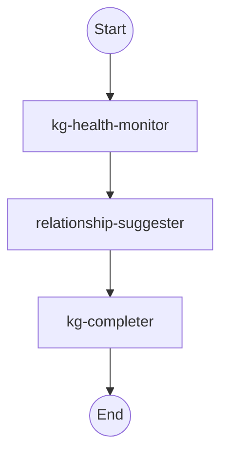
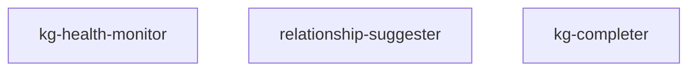
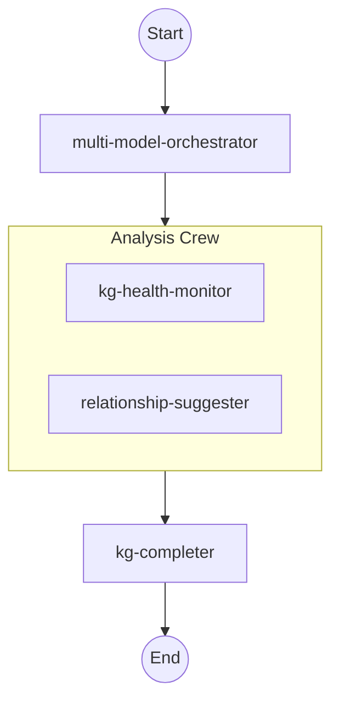
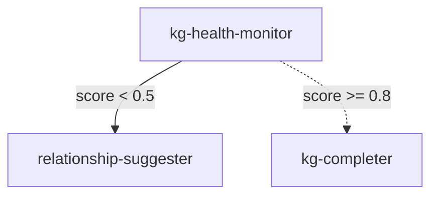
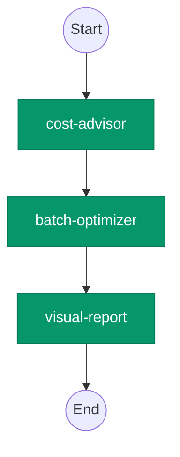

# NLKE Orchestration Format (.nof.md) Specification

**Version:** nof/1.0
**Status:** Stable
**Date:** February 7, 2026
**Authors:** NLKE Agent Ecosystem

---

## Table of Contents

1. [Overview](#1-overview)
2. [Format Version](#2-format-version)
3. [File Structure](#3-file-structure)
4. [YAML Frontmatter Schema](#4-yaml-frontmatter-schema)
5. [Sections](#5-sections)
6. [Mermaid Topology Conventions](#6-mermaid-topology-conventions)
7. [State Schema Conventions](#7-state-schema-conventions)
8. [Agent Node Pattern](#8-agent-node-pattern)
9. [Routing Rule Syntax](#9-routing-rule-syntax)
10. [Cost Model](#10-cost-model)
11. [Example](#11-example)

---

## 1. Overview

The NLKE Orchestration Format (NOF) is a unified workflow definition format that merges three previously separate concerns into a single `.nof.md` file:

| Layer | Traditional Format | NOF Section |
|-------|-------------------|-------------|
| Logic | Markdown (`.md`) | Philosophy, Routing Rules |
| Topology | Mermaid (`.mmd`) | Topology diagram |
| Execution | Jupyter/Python (`.ipynb`/`.py`) | State Schema, Agent Nodes, Execution |

### Why NOF Exists

The NLKE ecosystem comprises 40 agents across 14 categories, orchestrated through the Pipeline SDK (`agents/shared/agent_sdk.py`). As workflows grew to involve multiple agents with conditional routing, crew-based parallelism, and shared state, defining them required scattering information across markdown documentation, Mermaid diagrams, and Python pipeline scripts. This fragmentation created drift: the diagram said one thing, the pipeline code did another, and the prose constraints lived nowhere machine-readable.

NOF solves this by placing all three layers in a single Markdown-compatible file. Because the format is `.nof.md`, it renders as readable documentation in any Markdown viewer while remaining parseable by the Pipeline SDK for direct execution. A NOF file is simultaneously a specification, a diagram, and a runnable program.

### Design Principles

- **Single Source of Truth.** One file defines the workflow's intent, topology, and execution.
- **Markdown-Native.** Every NOF file is valid Markdown. GitHub, VS Code, and documentation tools render it correctly without plugins.
- **Executable.** Python code blocks in the Agent Nodes and Execution sections run directly via the NLKE SDK.
- **Cost-Aware.** The frontmatter includes a cost estimate derived from the per-agent cost model, making budget decisions explicit at design time.
- **NLKE-Contract-Compliant.** Every agent node produces the standard output contract: `recommendations`, `rules_applied`, `meta_insight`.

---

## 2. Format Version

```
format: nof/1.0
```

The version string follows the pattern `nof/MAJOR.MINOR`. The current and only stable version is `nof/1.0`.

### Versioning Rules

- **MAJOR** increments indicate breaking changes to the frontmatter schema or section structure.
- **MINOR** increments indicate backward-compatible additions (new optional frontmatter fields, new optional sections).
- Parsers MUST reject files with an unrecognized MAJOR version.
- Parsers SHOULD accept files with a recognized MAJOR and unrecognized MINOR version, ignoring unknown fields gracefully.

---

## 3. File Structure

A `.nof.md` file consists of two parts: YAML frontmatter and Markdown body.

```
---
<YAML frontmatter>
---

# Workflow: <Name>

## Philosophy
<Markdown prose>

## Topology
<Mermaid diagram in fenced code block>

## State Schema
<Python TypedDict in fenced code block>

## Agent Nodes
<Python wrapper functions in fenced code block>

## Execution
<Pipeline SDK code in fenced code block>

## Routing Rules
<Bullet-point conditional rules>
```

### Requirements

- The YAML frontmatter block is REQUIRED and MUST appear at the very beginning of the file, delimited by `---` on its own line.
- The `# Workflow: [Name]` heading is REQUIRED and MUST be the first heading in the body.
- Sections `## Philosophy`, `## Topology`, `## Agent Nodes`, and `## Execution` are REQUIRED.
- Sections `## State Schema` and `## Routing Rules` are OPTIONAL but RECOMMENDED for workflows with more than two agents.
- Additional sections (e.g., `## Notes`, `## Changelog`) are permitted after the required sections and are ignored by parsers.

### File Naming

NOF files MUST use the extension `.nof.md`. The base name SHOULD be kebab-case and describe the workflow:

```
kg-enhancement-pipeline.nof.md
cost-audit-workflow.nof.md
codegen-fullstack.nof.md
```

---

## 4. YAML Frontmatter Schema

### Required Fields

| Field | Type | Description |
|-------|------|-------------|
| `format` | `string` | MUST be `"nof/1.0"` |
| `name` | `string` | Human-readable workflow name |
| `description` | `string` | One-line summary of what this workflow does |
| `agents` | `list[string]` | Ordered list of agent identifiers used in this workflow. Each identifier MUST match a key in the NLKE Agent Registry (`AGENT_MODULES` in `agent_sdk.py`). |

### Optional Fields

| Field | Type | Default | Description |
|-------|------|---------|-------------|
| `crews` | `map[string, list[string]]` | `{}` | Named groups of agents that execute as a parallel unit. Keys are crew names; values are lists of agent identifiers. |
| `state_schema` | `string` | `null` | Name of the TypedDict class defined in the State Schema section. |
| `routing` | `enum` | `"sequential"` | Execution strategy. One of: `sequential`, `hierarchical`, `dynamic`. |
| `cost_estimate` | `string` | `null` | Estimated cost per run in USD, e.g., `"$0.022"`. Derived from the Cost Model (Section 10). |
| `created` | `string` (ISO 8601) | `null` | Date the workflow was created, e.g., `"2026-02-07"`. |
| `version` | `string` | `"1.0.0"` | Semantic version of this specific workflow definition. |
| `tags` | `list[string]` | `[]` | Freeform tags for categorization. |

### Routing Modes

| Mode | Behavior |
|------|----------|
| `sequential` | Agents execute in the order listed in `agents`, each receiving the previous agent's output. This is the default. |
| `hierarchical` | A designated orchestrator agent delegates to sub-agents and aggregates results. The first agent in the `agents` list is the orchestrator. |
| `dynamic` | Routing is determined at runtime by the Routing Rules section. An agent's output is inspected, and the next agent is selected conditionally. |

### Frontmatter Example

```yaml
---
format: nof/1.0
name: KG Enhancement Pipeline
description: Diagnose, suggest, and complete knowledge graph improvements
agents:
  - kg-health-monitor
  - relationship-suggester
  - kg-completer
crews:
  analysis: [kg-health-monitor, relationship-suggester]
state_schema: KGWorkflowState
routing: sequential
cost_estimate: "$0.00625"
created: "2026-02-07"
tags: [knowledge-graph, enhancement, pipeline]
---
```

---

## 5. Sections

### 5.1 `# Workflow: [Name]`

The top-level heading identifies the workflow. The name SHOULD match the `name` field in the frontmatter.

```markdown
# Workflow: KG Enhancement Pipeline
```

### 5.2 `## Philosophy`

Markdown prose describing the workflow's purpose, constraints, and design rationale. This section communicates intent to human readers and can also be consumed by LLM-based orchestrators to inform routing decisions.

Content SHOULD cover:

- **Purpose:** What problem this workflow solves.
- **Constraints:** Token budgets, latency requirements, cost ceilings.
- **Routing rationale:** Why agents are ordered or grouped the way they are.
- **Failure policy:** What happens when an agent fails (skip, retry, abort).

```markdown
## Philosophy

This workflow performs a three-phase knowledge graph enhancement. The KG Health
Monitor runs first to produce a diagnostic report. If the health score is below
0.7, the Relationship Suggester is invoked to propose new edges. The KG Completer
finalizes by filling gaps identified in the first two phases.

**Constraints:**
- Total budget: $0.01 per invocation
- Target latency: < 5 seconds (all agents are Haiku/Sonnet tier)
- Failure policy: If kg-health-monitor fails, abort the pipeline
```

### 5.3 `## Topology`

A Mermaid `graph TD` (top-down) diagram enclosed in a fenced code block with the language identifier `mermaid`. This diagram provides a visual representation of the agent flow, including parallel crews, conditional branches, and data dependencies.

````markdown
## Topology


````

See Section 6 for detailed Mermaid conventions.

### 5.4 `## State Schema`

A Python `TypedDict` class enclosed in a fenced code block with the language identifier `python`. This schema defines the shared state object that flows between agent nodes. The class name MUST match the `state_schema` field in the frontmatter.

````markdown
## State Schema

```python
from typing import TypedDict, Annotated, List, Dict, Any
import operator

class KGWorkflowState(TypedDict):
    """Shared state flowing through the KG Enhancement pipeline."""
    db_path: str
    health_score: float
    recommendations: Annotated[List[Dict[str, Any]], operator.add]
    rules_applied: Annotated[List[str], operator.add]
    meta_insights: Annotated[List[str], operator.add]
    errors: Annotated[List[str], operator.add]
```
````

See Section 7 for TypedDict conventions.

### 5.5 `## Agent Nodes`

Python wrapper functions enclosed in a fenced code block with the language identifier `python`. Each function takes the shared state as input, invokes a single NLKE agent, and returns a state update dictionary. These functions act as adapters between the shared state schema and the agent's expected `AgentInput` format.

````markdown
## Agent Nodes

```python
from agents.shared.agent_sdk import AgentRunner
from agents.shared.agent_base import AgentInput

def run_kg_health(state: KGWorkflowState) -> dict:
    """Invoke kg-health-monitor and extract results into shared state."""
    result = AgentRunner.run("kg-health-monitor", {
        "db_path": state["db_path"],
    })
    if not result.success:
        return {"errors": [f"kg-health-monitor failed: {result.error}"]}
    return {
        "health_score": result.output.get("analysis_data", {}).get("health_score", 0.0),
        "recommendations": result.output.get("recommendations", []),
        "rules_applied": result.output.get("rules_applied", []),
        "meta_insights": [result.output.get("meta_insight", "")],
    }

def run_relationship_suggester(state: KGWorkflowState) -> dict:
    """Invoke relationship-suggester using health report context."""
    result = AgentRunner.run("relationship-suggester", {
        "health_score": state["health_score"],
        "db_path": state["db_path"],
    })
    if not result.success:
        return {"errors": [f"relationship-suggester failed: {result.error}"]}
    return {
        "recommendations": result.output.get("recommendations", []),
        "rules_applied": result.output.get("rules_applied", []),
        "meta_insights": [result.output.get("meta_insight", "")],
    }

def run_kg_completer(state: KGWorkflowState) -> dict:
    """Invoke kg-completer to fill remaining gaps."""
    result = AgentRunner.run("kg-completer", {
        "health_score": state["health_score"],
        "recommendations_so_far": state["recommendations"],
    })
    if not result.success:
        return {"errors": [f"kg-completer failed: {result.error}"]}
    return {
        "recommendations": result.output.get("recommendations", []),
        "rules_applied": result.output.get("rules_applied", []),
        "meta_insights": [result.output.get("meta_insight", "")],
    }
```
````

See Section 8 for the wrapper function pattern.

### 5.6 `## Execution`

Pipeline SDK code enclosed in a fenced code block with the language identifier `python`. This section wires the agent nodes together using `from agents.shared.agent_sdk import Pipeline` and produces a runnable pipeline.

````markdown
## Execution

```python
from agents.shared.agent_sdk import Pipeline

pipeline = Pipeline("KG Enhancement Pipeline")
pipeline.add("kg-health-monitor", workload={"db_path": "knowledge.db"})
pipeline.add("relationship-suggester", depends_on=["kg-health-monitor"])
pipeline.add("kg-completer", depends_on=["relationship-suggester"])

result = pipeline.run()
print(f"Pipeline: {result.name}")
print(f"Steps: {result.succeeded}/{result.total_steps} succeeded")
print(f"Duration: {result.total_duration_ms}ms")
print(f"Total recommendations: {len(result.aggregated_recommendations)}")
```
````

### 5.7 `## Routing Rules`

Conditional routing rules written as a bullet-point list. Each rule follows a structured `If-Then` syntax. This section is OPTIONAL and is only meaningful when `routing: dynamic` is set in the frontmatter.

```markdown
## Routing Rules

- **If** `health_score < 0.5` **then** route to `relationship-suggester` with priority `high`
- **If** `health_score >= 0.5 AND health_score < 0.8` **then** route to `relationship-suggester` with priority `normal`
- **If** `health_score >= 0.8` **then** skip `relationship-suggester`, route directly to `kg-completer`
- **If** `errors` is non-empty **then** abort pipeline, return partial results
- **Checkpoint** after `kg-health-monitor`: persist state to `checkpoints/kg-health.json`
- **Cycle-back** if `kg-completer.meta_insight` contains "incomplete": re-run from `relationship-suggester` (max 2 cycles)
```

See Section 9 for the full routing rule syntax.

---

## 6. Mermaid Topology Conventions

### Node Naming

Nodes MUST use abbreviated identifiers in square brackets that match agent registry keys:



The node ID (left of the bracket) is a short alias used for wiring. The label (inside the bracket) is the full agent registry key.

### Terminal Nodes

Use double-parenthesis notation for start and end terminals:

```mermaid
START((Start)) --> KGH[kg-health-monitor]
KGC[kg-completer] --> END((End))
```

### Subgraphs for Crews

When agents belong to a named crew (parallel execution group), wrap them in a `subgraph`:



### Arrow Styles

| Arrow | Meaning |
|-------|---------|
| `-->` | Sequential dependency (output of source feeds into target) |
| `-.->` | Conditional/optional edge (may be skipped based on routing rules) |
| `==>` | Parallel fan-out (source triggers all targets simultaneously) |
| `--text-->` | Labeled edge describing the data passed |

### Conditional Branches

Use dotted arrows with labels for conditional routing:



### Style Classes

NOF defines optional style classes for visual distinction by model tier:

```mermaid
classDef opus fill:#7c3aed,stroke:#5b21b6,color:#fff
classDef sonnet fill:#2563eb,stroke:#1d4ed8,color:#fff
classDef haiku fill:#059669,stroke:#047857,color:#fff

class ORCH opus
class RS,KGC sonnet
class KGH haiku
```

---

## 7. State Schema Conventions

### TypedDict Base

All state schemas MUST be defined as Python `TypedDict` subclasses:

```python
from typing import TypedDict

class MyWorkflowState(TypedDict):
    input_field: str
    output_field: float
```

### Annotated Types with Reducers

For fields that accumulate values across multiple agent nodes (lists that grow with each step), use `Annotated` with a reducer function. The canonical reducer for list accumulation is `operator.add`:

```python
from typing import Annotated, List, Dict, Any
import operator

class MyWorkflowState(TypedDict):
    # Scalar field: overwritten by each agent
    current_score: float

    # Accumulator field: appended to by each agent
    recommendations: Annotated[List[Dict[str, Any]], operator.add]
    rules_applied: Annotated[List[str], operator.add]
    meta_insights: Annotated[List[str], operator.add]
    errors: Annotated[List[str], operator.add]
```

### Required Fields

Every NOF state schema MUST include these accumulator fields to satisfy the NLKE output contract:

| Field | Type | Description |
|-------|------|-------------|
| `recommendations` | `Annotated[List[Dict[str, Any]], operator.add]` | Aggregated recommendations from all agents |
| `rules_applied` | `Annotated[List[str], operator.add]` | All synthesis rules invoked |
| `meta_insights` | `Annotated[List[str], operator.add]` | One meta-insight per agent |
| `errors` | `Annotated[List[str], operator.add]` | Error messages from failed agents |

Additional workflow-specific fields are defined as needed.

### Initial State

The Execution section MUST initialize the state with empty accumulators and required input values:

```python
initial_state: KGWorkflowState = {
    "db_path": "knowledge.db",
    "health_score": 0.0,
    "recommendations": [],
    "rules_applied": [],
    "meta_insights": [],
    "errors": [],
}
```

---

## 8. Agent Node Pattern

### Structure

Every agent node function follows this pattern:

```python
def run_<agent_slug>(state: WorkflowState) -> dict:
    """<One-line description of what this node does.>"""
    # 1. Extract relevant fields from shared state
    workload = {
        "key": state["field"],
    }

    # 2. Invoke the agent via AgentRunner
    result = AgentRunner.run("<agent-registry-key>", workload)

    # 3. Handle failure
    if not result.success:
        return {"errors": [f"<agent-name> failed: {result.error}"]}

    # 4. Return state update dictionary
    return {
        "recommendations": result.output.get("recommendations", []),
        "rules_applied": result.output.get("rules_applied", []),
        "meta_insights": [result.output.get("meta_insight", "")],
        # ... additional workflow-specific fields
    }
```

### Naming Convention

The function name MUST be `run_` followed by the agent's registry key with hyphens replaced by underscores:

| Agent Registry Key | Function Name |
|-------------------|---------------|
| `kg-health-monitor` | `run_kg_health_monitor` |
| `cost-advisor` | `run_cost_advisor` |
| `codegen-python` | `run_codegen_python` |
| `multi-model-orchestrator` | `run_multi_model_orchestrator` |

### State Filtering

Agent node functions MUST perform state filtering: they extract only the fields relevant to their agent from the shared state and pass them as a flat workload dictionary. Agents MUST NOT receive the entire shared state object. This ensures:

1. **Isolation.** Agents do not depend on fields they do not use.
2. **Testability.** Each node can be tested with a minimal mock state.
3. **Security.** Sensitive fields (API keys, paths) are only passed to agents that need them.

### Return Contract

The returned dictionary MUST contain only keys that exist in the state schema. Keys with `Annotated[List, operator.add]` types are appended; all other keys overwrite the current value.

---

## 9. Routing Rule Syntax

### Basic Conditional

```
- **If** `<condition>` **then** route to `<agent-key>`
```

The condition is a Python-evaluable expression referencing state schema fields:

```
- **If** `health_score < 0.5` **then** route to `relationship-suggester` with priority `high`
- **If** `len(recommendations) > 10` **then** route to `visual-report`
```

### Skip Rule

```
- **If** `<condition>` **then** skip `<agent-key>`, route directly to `<agent-key>`
```

Skips one or more agents when a condition is met:

```
- **If** `health_score >= 0.9` **then** skip `relationship-suggester`, route directly to `kg-completer`
```

### Abort Rule

```
- **If** `<condition>` **then** abort pipeline, return partial results
```

Terminates the pipeline early. The partial `PipelineResult` is returned with whatever steps completed:

```
- **If** `errors` is non-empty **then** abort pipeline, return partial results
- **If** `cost_so_far > 0.05` **then** abort pipeline, return partial results
```

### Checkpoint Rule

```
- **Checkpoint** after `<agent-key>`: persist state to `<path>`
```

Saves the current state to disk after a specific agent completes. Used for long-running workflows and recovery:

```
- **Checkpoint** after `kg-health-monitor`: persist state to `checkpoints/kg-health.json`
```

### Cycle-Back Rule

```
- **Cycle-back** if `<condition>`: re-run from `<agent-key>` (max <N> cycles)
```

Re-executes a portion of the pipeline when a condition indicates the result is insufficient. The `max` clause prevents infinite loops:

```
- **Cycle-back** if `kg-completer.meta_insight` contains "incomplete": re-run from `relationship-suggester` (max 2 cycles)
```

### Priority Annotation

Any routing rule may include a `with priority` clause:

```
with priority `high` | `normal` | `low`
```

Priority affects execution order when multiple agents are eligible in `dynamic` routing mode. Higher priority agents execute first.

### Compound Conditions

Conditions may use `AND` and `OR`:

```
- **If** `health_score < 0.5 AND len(errors) == 0` **then** route to `relationship-suggester`
- **If** `cost_so_far > 0.03 OR len(recommendations) > 20` **then** route to `visual-report`
```

---

## 10. Cost Model

NOF includes a built-in cost model for estimating per-run workflow expenses. Costs are based on the NLKE model tier assignments.

### Per-Agent Cost Constants

| Model Tier | Cost per Call | Agents (count) |
|-----------|--------------|-----------------|
| **Opus** | $0.015 | 4 agents |
| **Sonnet** | $0.003 | 20 agents |
| **Haiku** | $0.00025 | 16 agents |

### Agent-to-Tier Mapping

**Opus Tier ($0.015/call):**
- `compound-intelligence` (emergent)
- `multi-model-orchestrator` (multi-model)
- `codegen-orchestrator` (codegen)
- opus-expender (foundation -- not in SDK registry)

**Sonnet Tier ($0.003/call):**
- `relationship-suggester`, `kg-completer` (kg-enhancement)
- `workflow-orchestrator`, `generator-agent` (workflow-automation)
- `cost-quality-frontier` (emergent)
- `gemini-delegator`, `context-engineer` (multi-model)
- `rule-engine-agent` (rule-engine)
- `rag-kg-query`, `intent-engine`, `refactoring-agent` (knowledge-retrieval)
- `mcp-tool-creator` (mcp-tool-creator)
- `embedding-engine` (advanced)
- `gemini-compute`, `web-research` (cross-provider)
- `agentic-tool-router` (routing)
- `codegen-python`, `codegen-javascript`, `codegen-html-css`, `codegen-gemini` (codegen)

**Haiku Tier ($0.00025/call):**
- `cost-advisor`, `batch-optimizer`, `thinking-budget-optimizer` (cost-optimization)
- `kg-health-monitor` (kg-enhancement)
- `progressive-assembly` (workflow-automation)
- `self-healing-docs` (emergent)
- `anti-pattern-validator`, `playbook-advisor` (rule-engine)
- `citation-analyzer` (advanced)
- `visual-report` (reporting)
- `codegen-sql`, `codegen-bash` (codegen)
- doc-updater, md-cat, py-cat (foundation -- not in SDK registry)

### Cost Estimation Formula

```
total_cost = SUM(tier_cost(agent) for agent in workflow.agents)
```

For workflows with crews (parallel groups), the cost is the same as sequential since all agents still execute once. For workflows with cycle-back rules, multiply the cost of the cycle segment by `max_cycles + 1`:

```
cycle_cost = segment_cost * (max_cycles + 1)
total_cost = non_cycle_cost + cycle_cost
```

### Frontmatter Cost Annotation

The `cost_estimate` field in the frontmatter SHOULD reflect the worst-case cost (all branches taken, maximum cycles):

```yaml
cost_estimate: "$0.00625"
```

### Example Calculation

A workflow using `kg-health-monitor` (haiku), `relationship-suggester` (sonnet), and `kg-completer` (sonnet) with a cycle-back rule (max 2 cycles on the last two agents):

```
Base cost:
  kg-health-monitor:      $0.00025
  relationship-suggester:  $0.003
  kg-completer:            $0.003
  ---
  Subtotal:                $0.00625

With cycle-back (max 2 cycles on suggester + completer):
  Cycle segment:           $0.003 + $0.003 = $0.006
  Worst-case cycles:       $0.006 * 2 = $0.012
  ---
  Worst-case total:        $0.00625 + $0.012 = $0.01825
```

---

## 11. Example

Below is a complete, minimal NOF file demonstrating all required sections.

---

````markdown
---
format: nof/1.0
name: Cost Audit Workflow
description: Analyze API costs, identify batch optimization opportunities, and produce a visual report
agents:
  - cost-advisor
  - batch-optimizer
  - visual-report
state_schema: CostAuditState
routing: sequential
cost_estimate: "$0.00075"
created: "2026-02-07"
tags: [cost-optimization, reporting]
---

# Workflow: Cost Audit Workflow

## Philosophy

This workflow performs a three-step cost audit. The Cost Advisor agent runs
first to identify high-spend areas and produce actionable recommendations.
The Batch Optimizer then analyzes the workload for batching opportunities
that reduce per-call costs. Finally, the Visual Report agent formats the
combined findings into a human-readable summary.

All three agents are Haiku-tier, making this the cheapest possible
three-agent pipeline at $0.00075 per invocation.

**Constraints:**
- Total budget ceiling: $0.005 per run
- All agents are Haiku tier for maximum cost efficiency
- Failure policy: If cost-advisor fails, abort (no data to optimize)

## Topology



## State Schema

```python
from typing import TypedDict, Annotated, List, Dict, Any
import operator

class CostAuditState(TypedDict):
    """Shared state for the Cost Audit workflow."""
    # Input
    api_calls: List[Dict[str, Any]]
    time_period: str

    # Accumulators (NLKE output contract)
    recommendations: Annotated[List[Dict[str, Any]], operator.add]
    rules_applied: Annotated[List[str], operator.add]
    meta_insights: Annotated[List[str], operator.add]
    errors: Annotated[List[str], operator.add]

    # Workflow-specific
    total_spend: float
    batch_savings: float
```

## Agent Nodes

```python
from agents.shared.agent_sdk import AgentRunner

def run_cost_advisor(state: CostAuditState) -> dict:
    """Analyze API call patterns and identify cost reduction opportunities."""
    result = AgentRunner.run("cost-advisor", {
        "api_calls": state["api_calls"],
        "time_period": state["time_period"],
    })
    if not result.success:
        return {"errors": [f"cost-advisor failed: {result.error}"]}
    return {
        "total_spend": result.output.get("analysis_data", {}).get("total_spend", 0.0),
        "recommendations": result.output.get("recommendations", []),
        "rules_applied": result.output.get("rules_applied", []),
        "meta_insights": [result.output.get("meta_insight", "")],
    }

def run_batch_optimizer(state: CostAuditState) -> dict:
    """Identify batching opportunities based on cost advisor findings."""
    result = AgentRunner.run("batch-optimizer", {
        "api_calls": state["api_calls"],
        "total_spend": state["total_spend"],
    })
    if not result.success:
        return {"errors": [f"batch-optimizer failed: {result.error}"]}
    return {
        "batch_savings": result.output.get("analysis_data", {}).get("estimated_savings", 0.0),
        "recommendations": result.output.get("recommendations", []),
        "rules_applied": result.output.get("rules_applied", []),
        "meta_insights": [result.output.get("meta_insight", "")],
    }

def run_visual_report(state: CostAuditState) -> dict:
    """Generate a visual summary of the cost audit findings."""
    result = AgentRunner.run("visual-report", {
        "total_spend": state["total_spend"],
        "batch_savings": state["batch_savings"],
        "recommendations": state["recommendations"],
    })
    if not result.success:
        return {"errors": [f"visual-report failed: {result.error}"]}
    return {
        "recommendations": result.output.get("recommendations", []),
        "rules_applied": result.output.get("rules_applied", []),
        "meta_insights": [result.output.get("meta_insight", "")],
    }
```

## Execution

```python
from agents.shared.agent_sdk import Pipeline

pipeline = Pipeline("Cost Audit Workflow")
pipeline.add("cost-advisor", workload={
    "api_calls": [
        {"model": "opus", "tokens": 50000, "count": 10},
        {"model": "sonnet", "tokens": 30000, "count": 200},
        {"model": "haiku", "tokens": 5000, "count": 1500},
    ],
    "time_period": "2026-01",
})
pipeline.add("batch-optimizer", depends_on=["cost-advisor"])
pipeline.add("visual-report", depends_on=["batch-optimizer"])

result = pipeline.run()

print(f"Pipeline: {result.name}")
print(f"Steps: {result.succeeded}/{result.total_steps} succeeded")
print(f"Duration: {result.total_duration_ms}ms")
print(f"Total recommendations: {len(result.aggregated_recommendations)}")
print(f"Rules applied: {', '.join(result.aggregated_rules)}")
```

## Routing Rules

- **If** `total_spend == 0.0` **then** skip `batch-optimizer`, route directly to `visual-report`
- **If** `errors` is non-empty **then** abort pipeline, return partial results
- **Checkpoint** after `cost-advisor`: persist state to `checkpoints/cost-audit.json`
````

---

## Appendix A: NLKE Agent Registry Reference

The following 35 agents are registered in the Pipeline SDK (`agents/shared/agent_sdk.py`) and available for use in NOF workflows:

| Agent Key | Category | Tier |
|-----------|----------|------|
| `cost-advisor` | cost-optimization | Haiku |
| `batch-optimizer` | cost-optimization | Haiku |
| `thinking-budget-optimizer` | cost-optimization | Haiku |
| `kg-health-monitor` | kg-enhancement | Haiku |
| `relationship-suggester` | kg-enhancement | Sonnet |
| `kg-completer` | kg-enhancement | Sonnet |
| `workflow-orchestrator` | workflow-automation | Sonnet |
| `generator-agent` | workflow-automation | Sonnet |
| `progressive-assembly` | workflow-automation | Haiku |
| `compound-intelligence` | emergent | Opus |
| `self-healing-docs` | emergent | Haiku |
| `cost-quality-frontier` | emergent | Sonnet |
| `multi-model-orchestrator` | multi-model | Opus |
| `gemini-delegator` | multi-model | Sonnet |
| `context-engineer` | multi-model | Sonnet |
| `rule-engine-agent` | rule-engine | Sonnet |
| `anti-pattern-validator` | rule-engine | Haiku |
| `playbook-advisor` | rule-engine | Haiku |
| `rag-kg-query` | knowledge-retrieval | Sonnet |
| `intent-engine` | knowledge-retrieval | Sonnet |
| `refactoring-agent` | knowledge-retrieval | Sonnet |
| `mcp-tool-creator` | mcp-tool-creator | Sonnet |
| `embedding-engine` | advanced | Sonnet |
| `citation-analyzer` | advanced | Haiku |
| `gemini-compute` | cross-provider | Sonnet |
| `web-research` | cross-provider | Sonnet |
| `visual-report` | reporting | Haiku |
| `agentic-tool-router` | routing | Sonnet |
| `codegen-python` | codegen | Sonnet |
| `codegen-javascript` | codegen | Sonnet |
| `codegen-sql` | codegen | Haiku |
| `codegen-bash` | codegen | Haiku |
| `codegen-html-css` | codegen | Sonnet |
| `codegen-gemini` | codegen | Sonnet |
| `codegen-orchestrator` | codegen | Opus |

## Appendix B: Grammar (Informative)

A simplified EBNF-style grammar for the NOF routing rule syntax:

```ebnf
rule           = conditional | skip | abort | checkpoint | cycleback
conditional    = "**If**" condition "**then**" action [priority]
skip           = "**If**" condition "**then**" "skip" agent-key "," "route directly to" agent-key
abort          = "**If**" condition "**then**" "abort pipeline, return partial results"
checkpoint     = "**Checkpoint**" "after" agent-key ":" "persist state to" path
cycleback      = "**Cycle-back**" "if" condition ":" "re-run from" agent-key "(" "max" INTEGER "cycles" ")"

condition      = expression ( ("AND" | "OR") expression )*
expression     = field operator value
               | field "is non-empty"
               | field "contains" STRING

action         = "route to" agent-key
priority       = "with priority" ( "high" | "normal" | "low" )

agent-key      = "`" IDENTIFIER "`"
field          = "`" IDENTIFIER ( "." IDENTIFIER )* "`"
path           = "`" PATH "`"
operator       = "<" | ">" | "<=" | ">=" | "==" | "!="
value          = NUMBER | STRING
```

---

**End of Specification**
